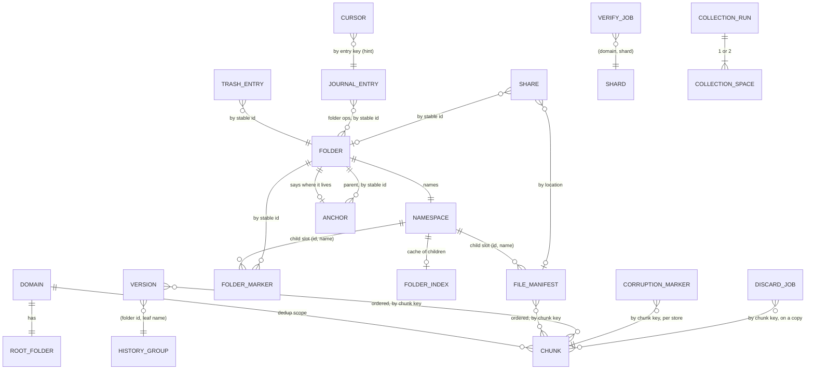

# Data model — what a domain stores on its backend

This file specifies the abstract model of the shared object store: the entities every client of a domain
reads and writes, how they relate, the invariants that hold between them, who may write what, and how
independent clients agree on folder identity. It owns the entity lifecycles, the invariants and the
folder-identity arbitration protocol.

It names no byte format or key spelling except in §9. Which stored formats are frozen (core) and which
may change (ephemeral) is stated in [02-remote-model.md](../02-remote-model.md). Byte formats and key spellings are owned by
[02-remote-model.md](../02-remote-model.md); the store contract by [06-backends.md](../06-backends.md);
retention and garbage collection by [algorithms/gc.md](../algorithms/gc.md); journal and cursor
formats by [03-journal-sync.md](../03-journal-sync.md); local state by
[local-cache.md](local-cache.md). Implementation notes: [ocaml/data-model/backend.md](../ocaml/data-model/backend.md).

---

## 1. Purpose and the medium

**Purpose.** Hold one user tree (a *domain*) so that any number of clients can lazily read it, write it
concurrently, rename folders cheaply, keep history and reclaim space, with no server logic beyond the
store itself and an optional bucket function (integrity checks and queued deletes).

**What the medium offers** (the full contract is [06-backends.md](../06-backends.md)):

- Named objects with opaque byte bodies; each write is **atomically visible** (absent or whole).
- Read whole, read a byte range, existence probe with size, modification time and (usually) an entity
  tag, delete (single and batched), server-side copy.
- Listing by name prefix.
- **One arbitration primitive: create-if-absent**, answering the body that holds the name afterwards.
  Nothing else arbitrates: in particular, whether a delete reports that the object existed MUST NOT be
  used to decide between clients.
- On a filesystem store only: rename within the tree, and host-level advisory locks.

**What it lacks.** No multi-object transaction, no compare-and-swap on an existing object, no ordering
or snapshot guarantee across listings, no server-side triggers except object-created notifications to
the bucket function, and a rate limit on repeated writes to one name (about one per second). A
conditional delete (delete only the version read) is available on some stores and MUST NOT be relied
on for correctness.

**Who shares it.** Every client of the domain (desktop owners, mobile apps, one-shot commands acting
through or as an owner), http-proxy servers re-exporting a store, the collector (on the host that owns
a filesystem main), the bucket function (per object store), and share servers. They never talk to
each other; the store and the journal are the only channels.

**Scope of one layout.** One domain is one abstract layout. A physical store may hold many domains side
by side; a domain may be spread over several stores (*members*), each holding a copy of the same layout
at a different degree of completeness (§5.3).

---

## 2. Entities

*Identity* is what makes two instances the same object. *Mutability* is one of **immutable**,
**replaced whole** (last writer wins), **create-if-absent** (first writer wins) or **appended** (new
objects added, existing ones immutable).

### 2.1 Domain

- **Represents** one synchronised tree and everything needed to operate it.
- **Identity** its name, unique within a store, following the domain-name grammar of
  [01-core.md](../01-core.md) (which excludes the reserved sibling-tree names of §5.4).
- **Attributes** none stored. Configuration (members, roles, chunk size, versioning) is local to each
  client and MAY differ between clients.
- **Lifecycle** exists once any object under it exists. Dropping a domain MUST delete its own tree, its
  entries in the three sibling trees of §5.4 and every share naming it (§2.18).

### 2.2 Chunk

- **Represents** a contiguous slice of a regular file's bytes.
- **Identity** its chunk key, a 128-bit non-cryptographic digest of its bytes
  ([01-core.md](../01-core.md), chunk keys). Two chunks with equal bytes are the same chunk. Any reader
  can check a chunk against its key; the check detects accidental damage, not a forged body (threat
  model: [algorithms/security-model.md](../algorithms/security-model.md)).
- **Attributes** the bytes; the length is implicit.
- **Mutability** immutable in meaning; a re-put writes the same bytes and refreshes the object's
  modification time.
- **Cardinality** one per distinct slice content **per domain** (the dedup scope is the domain). The
  empty body is a chunk: every empty regular file names it.
- **Lifecycle** created by an uploading client before any manifest names it. Never updated. Deleted only
  by a collection ([algorithms/gc.md](../algorithms/gc.md)): directly on the collected main, by queued
  or direct delete on copies.

### 2.3 File manifest

- **Represents** the current content of one regular file or symlink at one place in the tree.
- **Identity** its **location**: (containing folder id, leaf name).
- **Attributes** logical size, modification time, the chunk size used to cut it, the ordered list of chunk
  keys (index *i* covers bytes `[i·chunk_size, …)`), a whole-file digest derived from the ordered chunk
  keys and lengths, the leaf name recorded at write time, and for a symlink its target and no chunks.
- **Mutability** replaced whole. Concurrent writers are resolved above the store, through the journal
  ([algorithms/conflict-resolution.md](../algorithms/conflict-resolution.md)).
- **Recorded name** informational; the location is authoritative. It exists because places a manifest
  body is copied to (versions, share, cache) cannot yield the name back. A reader that has the location
  MUST use the location's leaf.
- **Lifecycle** created or replaced on publish. A file rename copies it to the new location, deletes the
  old one, then re-puts it so the recorded name matches. Deleted on file delete (prior bodies survive as
  versions when versioning is on), and with its namespace when a trashed folder is purged.

### 2.4 Folder

- **Represents** a directory, independent of where it sits.
- **Identity** a **stable folder id** (grammar: [01-core.md §2.5](../01-core.md#25-folder-ids)): minted
  by a client (§6.1), made final by a confirmed claim (§6.2).
  Never reused and never changed; it survives rename, move, trash and restore.
- **Attributes** none of its own; it names one **namespace** (§2.5) and is the subject of one **anchor**
  (§2.7).
- **Reserved ids** the **root** (the domain's top folder: no marker, no anchor, always exists) and the
  **trash** (a namespace holding trash entries, §2.8; never a real folder, never a parent of a marker).
- **Lifecycle** comes into being with its winning claim. A purge deletes its contents and leaves its
  anchor as a tombstone (§2.7).

### 2.5 Namespace

- **Represents** the set of direct children of one folder, file manifests and folder markers, plus the
  folder's own anchor and folder index.
- **Identity** the folder id. The namespace is not an object: it is the set of objects sharing the id.
  Listing it is the authoritative way to learn a folder's children.
- **Child slot** (folder id, leaf name). A file and a folder of the same name in the same folder share
  one child slot; the object there is one or the other, classified by its body.

### 2.6 Folder marker

- **Represents** "the folder with id *I* appears in folder *P* under name *N*".
- **Identity** its child slot (*P*, *N*).
- **Attributes** *I* and *N*.
- **Mutability** **create-if-absent**. Every write of a folder marker, whether a first claim, a mkdir, a
  move or a restore, is a create-if-absent (§6). A folder marker is never written with a plain put.
- **Validity** a marker whose id is empty or not a folder id is **unclassifiable**: readers
  skip it as a write in flight and never adopt its id.
- **Lifecycle** created by the first placement of a folder at that slot. Deleted when the folder moves
  away or goes to trash (by the mover), or when found **disowned** (§6.3) by a claimant of that slot or
  by integrity repair (§6.5).

### 2.7 Anchor

- **Represents** where a folder says it lives: (parent id, name), or "in trash" with a name.
- **Identity** the folder id (exactly one per folder, stored inside the folder's own namespace).
- **Mutability** replaced whole, written only by whoever places the folder (claim winner, mkdir, move,
  trash, restore) or by integrity repair.
- **Role** it arbitrates between markers (§6.3). A marker at (*P*, *N*) naming *I* is **filed** iff
  anchor(*I*) = (*P*, *N*), or *I* has no anchor. Otherwise it is **disowned** and every reader treats
  it as absent.
- **Tombstone** an anchor is never deleted by a purge: after its folder's contents are gone it keeps every
  marker still naming that id disowned (a marker a lost delete left elsewhere would otherwise read as
  filed and resurrect an empty folder). Only integrity repair, after a full walk proves no marker names
  the id, MAY delete a tombstone.

### 2.8 Trash entry

- **Represents** a deleted folder awaiting expiry or restore.
- **Identity** a random id in the trash namespace, one per deletion; a folder deleted, restored and
  deleted again has had two entries.
- **Attributes** folder id, name, and the domain-relative path at deletion time.
- **Mutability** immutable.
- **Age** the store-assigned modification time of the entry.
- **Lifecycle** created by folder delete, before the anchor says "in trash" (§6.4). Deleted by restore
  (after the folder is re-placed), by expiry or purge (after the subtree,
  [algorithms/gc.md](../algorithms/gc.md)), and by expiry when **stale** (its folder's anchor says the
  folder is live). The subtree is untouched while trashed: unreachable from root, still intact.

### 2.9 Version

- **Represents** a previous body of a file manifest.
- **Identity** (history group, timestamp). The **history group** is the manifest's location, so history
  follows a folder rename but not a file rename: a file rename leaves the old name's history as a
  deleted file, restorable under that name. (A rename costs one object; carrying history along would
  cost one copy per version.)
- **Timestamp** nanoseconds since the epoch. A writer MUST make the timestamps it creates for one history
  group strictly increasing, so two snapshots never share a key.
- **Attributes** the old manifest body verbatim (hence the recorded name of a deleted file).
- **Mutability** immutable; **appended** per group.
- **Lifecycle** created, when versioning is on, immediately before a manifest is replaced, deleted or
  renamed away. The snapshot is best effort: a failed snapshot MUST NOT block the write, and MUST be
  logged. Deleted by expiry by age.
- **Derived notion** a *deleted file* is a history group with versions and no live manifest at its
  location.

### 2.10 Journal entry

- **Represents** one unit of work a client published: an ordered batch of ops naming domain-relative
  paths and, for folder ops, folder ids.
- **Identity** (start time in ms, client id): a total order that is not causal.
- **Mutability** immutable; the journal is **appended** by many writers, and entries become visible out
  of key order.
- **Lifecycle** written after the store half of the work is visible; deleted by expiry. Formats and the
  replication protocol: [03-journal-sync.md](../03-journal-sync.md),
  [algorithms/wal-and-journal.md](../algorithms/wal-and-journal.md).

### 2.11 Cursor

- **Represents** a hint: "some writer recently published entry *K*".
- **Identity** one per domain. **Mutability** replaced whole, debounced; it may move backwards or be lost.
- **Role** lets idle readers watch one object; correctness never depends on it. Also the object the write
  guard probes to learn whether a main is reachable. Owned by [03-journal-sync.md](../03-journal-sync.md).

### 2.12 Folder index

- **Represents** a cache of a namespace's child bodies, each tagged with the entity tag the store
  reported for that child.
- **Identity** the folder id. **Mutability** replaced whole, written only by full walkers allowed to write.
- **Validity** an entry counts only if the live listing reports the same tag for that child; otherwise
  the child is read. It is meaningful only on the store whose tags it recorded, and MUST be neither read
  nor written for a domain with more than one readable member.
- **Lifecycle** rewritten when its coverage falls below a threshold; deleted with its namespace on purge.
  Nothing on the write path maintains it.

### 2.13 Collection run

- **Represents** an open chunk collection on one collectable main: phase, start time, and a progress
  cursor (last finished unit, by name).
- **Identity** one per domain per collectable main; it lives on that main only, never on copies.
- **Mutability** replaced whole; the phase is recorded before the step it names.
- **Effect on readers** its **presence**, whatever its body, means chunks may live in either of two
  collection spaces (§2.14).
- **Generation** a counter beside it on the first collectable main, persisting across runs: odd while a
  collection's deletions on copies are in flight, even once they settled. Memos of chunks present on a
  copy are tagged with it ([algorithms/gc.md §5.6](../algorithms/gc.md#56-the-generation-and-presence-memos)).
- **Lifecycle and exclusion** [algorithms/gc.md](../algorithms/gc.md).

### 2.14 Collection space

- **Represents** a named set of chunks. Normally one, the *surviving* space. During a run, also the
  *outgoing* space: everything that existed when the run opened and has not yet been proven live.
- **Identity** (domain, space). A chunk's identity does not depend on which space holds it.
- **Lifecycle** [algorithms/gc.md](../algorithms/gc.md).

### 2.15 Corruption marker

- **Represents** "this store's copy of chunk *C* is bad": wrong bytes (with the computed digest and size)
  or unreadable (with a reason), and a time.
- **Identity** (domain, chunk key) **per store**: it describes the bytes of the store it sits on.
- **Mutability** replaced whole. Its existence is the finding; the body is optional detail, and an
  unparseable body is still a marker.
- **Lifecycle** filed by a store's own checker (the local driver after a verified write, the bucket
  function on chunk creation and verify jobs) and by a verifying collection. Cleared by a good rewrite of
  the chunk (the checker deletes the marker before re-checking) and by a collection that deletes the
  chunk.
- **Effect** an uploader MUST NOT deduplicate against a chunk marked on any member it reads: it re-sends
  the bytes.

### 2.16 Verify job

- **Represents** a request to a store's bucket function: check every chunk of one shard of one domain.
- **Identity** (domain, shard). **Lifecycle** created by an integrity verification; deleted by the function
  after the shard is done (last, so a crashed check leaves evidence). Findings are corruption markers.

### 2.17 Discard job

- **Represents** a request, placed on a copy that supports queued deletion, to delete a list of chunks
  and their corruption markers.
- **Identity** (domain, collection run, last shard of the batch). The run in the identity keeps a later
  collection from overwriting an unconsumed request.
- **Lifecycle** written when a collection's delete reaches that copy; consumed and deleted by the bucket
  function, which leaves it in place if it refused any key. Execution rules (re-checks, re-delivery):
  [algorithms/gc.md](../algorithms/gc.md).

### 2.18 Share

- **Represents** a public, expiring link to one file or one folder.
- **Identity** a random token. Shares are **not** scoped by domain on the store (one shared tree per
  store, so IAM rules and lifecycle rules take one literal prefix); the body names its domain.
- **Attributes** format version, domain, expiry time, type, display filename, and a reference: for a file
  the manifest's **stored location**, for a folder its **folder id**.
- **Placement** on one member of the domain (the first readable member advertising a share endpoint),
  written directly, not through the composite. A share is not replicated: it exists only on the store
  that holds it.
- **Validity** a reader MUST refuse a share whose domain is not a valid domain name, whose file reference
  lies outside that domain's manifest area, or whose folder reference is not a valid folder id, and MUST
  refuse a share past its expiry.
- **Lifecycle** created by the share operation ([05-ops-config.md](../05-ops-config.md)); deleted by
  expiry once expired ([algorithms/gc.md](../algorithms/gc.md)) and when its domain is dropped.
- **Referent** a folder share follows the folder by id through moves and renames, and stops serving
  once the folder is trashed. A file share follows the manifest's location: it stops serving after a
  rename or delete of the file, and follows a rename of a containing folder.

### 2.19 Share artifact cache

- **Represents** assembled bytes a share server built: a whole file, or a folder archive; and a share's
  preview image, made by its creator or a share server.
- **Identity** a file served by content: the whole-file digest; a download of a share, or its preview
  image: the token.
- **Derived** entirely from chunks and manifests. A token-keyed folder archive MUST be rebuilt once older
  than `share_archive_max_age` (recommended 1 hour), so a folder share does not serve a frozen snapshot
  forever. Dropped whole by the clear-cache operation; token-keyed artifacts of deleted shares are
  deleted with them. A preview image is not deleted by age, since only a host with a thumbnailer can
  make it again; without it a link's preview falls back to the generic image.

### 2.20 Deferred debt (not a store object)

What a replica or backfill member owes relative to the mains is recorded client-side, per (domain,
member), as an ordered durable log of **bodyless** jobs: put *key*, copy *src→dst*, delete *keys*. The
job names what changed; bodies are re-read from the mains at execution time. It is the only record of
how a copy differs from the main; it is not replicated and not visible to other clients. Owned by
[algorithms/replication.md](../algorithms/replication.md).

---

## 3. Relations

| From → to | By | A dangling reference means | Readers MUST |
|---|---|---|---|
| manifest / version → chunk | chunk key | A copy behind its debt, or a violated invariant (§4.1) | fail the read with "missing"; never substitute bytes |
| marker → folder | stable id | The namespace may be empty (a new folder): legal | list it as an empty folder |
| anchor → parent folder | stable id | Parent trashed or purged: the folder is unreachable | not show it; integrity reports it |
| trash entry → folder | stable id | Folder restored or re-filed (anchor not "in trash") | treat the entry as stale: never purge through it |
| journal op → path / folder id | name + stable id | Normal: the store has moved on | resolve by the conflict tables |
| cursor → journal entry | entry key | Entry expired | ignore it |
| share → manifest location | (folder id, leaf) | File renamed or deleted | answer "not found" |
| share → folder id | stable id | Folder trashed or purged | answer "not found" |
| folder index entry → child | location + tag | Tag mismatch or child gone | ignore the entry |
| corruption marker → chunk | chunk key | Chunk gone: the marker is stale | ignore it |
| discard job → chunk | chunk key | Chunk already gone | treat the delete as done |

The **path of a file** is not stored anywhere as a unit: it is the chain root → marker → … → manifest
location, resolved by one read per segment, each segment validated by the target folder's anchor. Only
trash entries (path at deletion), journal ops and share filenames record paths, as history or display.

---

## 4. Invariants

### 4.1 At rest (after every writer has finished and every debt is paid)

1. **Referential completeness.** Every chunk named by a manifest or version exists (in either collection
   space during a run) on every member that holds that manifest or version.
2. **Content identity.** A chunk's bytes hash to its key, except where a corruption marker on that store
   says otherwise.
3. **One placement per folder.** For each folder id, at most one filed marker exists: the one at its
   anchor's (parent, name). A folder never appears at two paths.
4. **One occupant per child slot.** A slot holds a manifest, a folder marker, or nothing.
5. **Reachability.** Every live folder is reachable from root through filed markers. Every trashed folder
   is named by at least one trash entry, and its anchor says "in trash".
6. **Journal after state.** A journal entry exists only for work whose store half is already visible.
7. **Cursor names a published entry**, or is absent.
8. **Collection closure.** With no run open there is exactly one collection space. With a run open, every
   chunk named by a manifest or version that marking has passed, or that was published through the
   collection interlock since the run opened, is in the surviving space.
9. **Copies never hold unverifiable state.** A copy is written only while every main is reachable, and
   receives only what a main already took.
10. **Copy file completeness.** A manifest reaches a replica or backfill only after every chunk it names
    is confirmed there ("partial coverage, never partial files").

### 4.2 Temporarily violated, and who repairs

| Violation | Arises from | Repaired by |
|---|---|---|
| Orphan chunks (no manifest names them) | an upload that stopped before its manifest; deletes and expiry | the next collection |
| Unanchored marker | the window between a won claim and its anchor write | the claimant writes the anchor; integrity repair writes a missing one |
| Unconfirmed claim | the window of §6.2 | the claimant's confirmation, which sets the folder aside if it lost |
| Folder unreachable (anchor moved, destination marker not yet written) | a move or restore in progress | the mover's owed operation, retried from its WAL |
| Disowned marker still present | a lost or pending delete after a move or trash | the mover's owed delete, the next claimant of the slot, or integrity repair |
| File at old and new location | a file rename (copy then delete) | the mover's owed operation; the recorded name follows with the re-put |
| Journal entry missing for visible work | a crash between publish and journal write | the writer's WAL republishes it under the record's key |
| Stale trash entry (folder live) | a restore whose entry delete was lost | expiry deletes the entry alone; integrity repair |
| Chunk in the outgoing space while referenced | a run between its open and the marking of that namespace | marking, or the interlock's promotion before the reference is published |
| Copy behind the main | always, by design | the member's deferred job log |
| Folder index stale | any child write | readers validate per entry; the next full walk rewrites it |
| Corruption marker for a good chunk | a spurious finding, or a rewrite not yet re-checked | re-verification |
| Orphan namespace (content no marker reaches) | a move or restore cut short and never resumed | the owner's WAL; after a grace period, adoption into the trash ([algorithms/gc.md](../algorithms/gc.md)) |

### 4.3 Ordering rules (crash consistency)

The atomicity unit is one object. Every multi-object change MUST be ordered so that a crash at any point
leaves the old state, the new state, or a state readers classify safely.

1. **Referent before referrer.** Chunks before the manifest naming them; manifests and markers before
   the journal entry; the journal entry before the cursor bump. This holds on every member and for every
   writer, including member-to-member mirror and repair: a manifest is never written to a store before
   every chunk it names is present there.
2. **Interlock before reference.** On a collectable main, a manifest or version becomes visible only
   through the collection interlock ([algorithms/gc.md](../algorithms/gc.md)).
3. **Authority before evidence** for a folder whose id is already settled: the anchor is written before
   the marker it validates (mkdir, move, restore), and a trash entry before the anchor says "in trash",
   before the live marker is deleted. A first claim is the one exception (§6.2): the marker is the claim,
   and the anchor follows.
4. **Old version before overwrite.** The version snapshot is taken before a manifest is replaced, deleted
   or renamed away.
5. **Namer deleted last.** A purge deletes a subtree deepest namespace first and the trash entries that
   name it last.
6. **State before step.** A collection records its phase before performing it, and its progress after
   each finished unit; every step is idempotent.
7. **Deletes owed to copies are durable before the main discards.** A collection records each copy's
   deletes durably before removing the chunks from the main, so a crash repeats deletes rather than
   leaking them.

---

## 5. Ownership and concurrency

### 5.1 Writers per entity

| Entity | Writers | Arbitration |
|---|---|---|
| Chunk | any client (uploads), deferred workers (copies), integrity repair (one member) | none needed: same name, same bytes |
| Chunk deletion | a collection only | the collection interlock on the collected main ([algorithms/gc.md](../algorithms/gc.md)) |
| File manifest | any client | last writer wins on the store; conflicts resolved in the journal layer |
| Folder marker | any client, integrity repair | **create-if-absent**, then confirmation (§6) |
| Anchor | whoever places the folder; integrity repair | last writer wins; readers settle markers by it |
| Trash entry | the deleting client; restore and expiry delete it | unique random identity |
| Version | the client replacing, deleting or renaming a manifest | unique increasing timestamp per group |
| Journal entry | each client its own keys | unique (time, client id); immutable |
| Cursor | any publishing client | last writer wins, debounced |
| Folder index | full walkers allowed to write | last writer wins; validated per entry at read |
| Collection run, spaces | the collector on the main's host | [algorithms/gc.md](../algorithms/gc.md) |
| Corruption marker | the store's checker, a verifying collection | the checker deletes before re-checking |
| Verify / discard job | the requesting client; the bucket function consumes it | identity includes shard (and run) |
| Share, share cache | the sharing client; share servers | unique token; the cache is rebuildable |

### 5.2 What readers may observe mid-change

- An object mid-write is absent or whole. A child that is listed but unparseable is a write in flight:
  readers skip it rather than fail, except the collector, which stops rather than risk a discard.
- A child listed but gone on read is a *permanent* miss for that child. A deleter MUST NOT take it as the
  absence of the whole folder.
- Journal entries appear out of key order; a reader lists the whole window and dedupes.
- During a run, a chunk may be in either space. The collected main's driver scopes every chunk access:
  it looks in the surviving space, then the outgoing one, and re-checks the run's presence before answering
  "absent"; a server re-exporting that main (an http-proxy) inherits this through the driver
  ([algorithms/gc.md §5.8](../algorithms/gc.md#58-chunk-access-is-scoped-by-the-driver)).
- A manifest may name chunks a copy does not yet hold. A reader fails over to a copy only when no main is
  reachable, never because of a miss on a reachable main.

### 5.3 Members: mains, replicas, backfills, archives

All members of a domain hold the same abstract layout; they differ in what they carry and how current it
is. Roles, the composite and deferred work are owned by [algorithms/replication.md](../algorithms/replication.md).

| Member | Written | Read | Carries |
|---|---|---|---|
| **main** (≥ 1) | every write, synchronously | the first main is the read primary; a miss there is authoritative | everything; a collectable main also carries its run and outgoing space |
| **replica** | every write, deferred through the durable job log | only when no main is reachable | everything except folder indexes and collection state; a lagging prefix-closed subset of the main, possibly with extra chunks (deletes not yet applied) |
| **backfill** | as a replica | never | content only: no journal, cursor or indexes |
| **archive** (read-only) | never | on a source-of-truth miss or when the mains are unreachable | different content (a frozen or foreign copy of the layout) |

Consequences:

- **Per-member entities.** Corruption markers, verify jobs, discard jobs, shares and collection state
  describe one store and live on it.
- **Copies re-read from mains only**, so a stale body is never propagated from another copy.
- **Write guard.** A copy is never written directly (mirror, repair, verify, share) while a main is
  unreachable.
- **Mirror** (member to member) is additive: it copies what the destination lacks or holds at a
  different size, never deletes, excludes indexes and collection state, and obeys §4.3 rule 1 (chunks
  before the manifests naming them).

### 5.4 Multi-domain

- **Dedup scope is the domain.** Identical chunks in two domains are stored twice, so a domain can be
  dropped by prefix without reference counting across domains.
- **Siblings, not children.** Corruption markers, verify jobs and discard jobs are keyed by domain name in
  trees beside the domain trees (so the bucket function and lifecycle rules can target each by one
  prefix); shares are one store-wide tree. The names of those trees are reserved and are not valid domain
  names ([01-core.md](../01-core.md)).

---

## 6. Folder identity arbitration

Folders are the one place where independent clients must agree on a single answer (which id a name
denotes) through a store without transactions. The protocol: mint without coordination, claim with
create-if-absent, settle with anchors, place with create-if-absent, and **confirm** every placement
after the window in which a concurrent delete could still undo it. Every write of a folder marker is a
create-if-absent; no step writes a marker with a plain put. The protocol is correct on any store that
meets §6.7, including one that answers create-if-absent unreliably: confirmation turns every lost race
into a folder conflict resolved by setting one folder aside, never into a stranded subtree.

### 6.1 Minting

- A folder id is (client identity prefix, counter), minted as specified in
  [03-journal-sync.md §2.1](../03-journal-sync.md#21-client-identity-and-folder-id-leases-local), which
  guarantees that no two processes of one client mint the same id.
- Minting needs no store round trip. A minted id is only a **candidate**: it says nothing about which id a
  name denotes.

### 6.2 Claiming a name for a new folder

To publish into a folder the store does not file yet, a client claims it, parents first, root down, so
every claim names a slot under an agreed parent id. A claim of slot (*P*, *N*) with candidate *I*:

1. **Create-if-absent** the marker (*I*, *N*) at (*P*, *N*). Read the answer as follows:
   - the answer names *I*: **won**. Write anchor(*I*) = (*P*, *N*).
   - the answer names another id *J* that is filed there (§6.3): **taken**. The client adopts *J*,
     discards *I*, and files its content under *J*. A folder that must stay distinct (the conflict
     tables decide) is set aside under a conflicted-copy name, which is claimed afresh.
   - the answer names *J* that is disowned: the slot holds litter. The client removes it (§6.5) and
     claims again.
   - the answer is empty or unparseable (a store or server that did not arbitrate): the client MUST read
     the slot back and apply the three cases above to what it reads; an empty slot means claim again.
     An empty answer MUST NOT be read as "won".
2. A slot that already names *I* when claimed again: if anchor(*I*) is absent, write it; if anchor(*I*) =
   (*P*, *N*), the claim is held; if the anchor places *I* elsewhere, the folder has moved and the claim
   fails transiently (the client's view is behind; sync resolves it).
3. **Confirm.** A won claim is **tentative** until confirmed. At least `claim_settle` after its
   create-if-absent landed, the claimant reads the slot again:
   - it still names *I*: the claim is **final**;
   - it names another filed id: the claimant **lost** the name after the fact. It MUST set its folder
     aside under a conflicted-copy name by the placement procedure of §6.4 (its content is kept, under
     its own id, at the new name), and resolve the clash as a folder conflict
     ([algorithms/conflict-resolution.md](../algorithms/conflict-resolution.md));
   - it is empty or disowned: the claimant claims again with *I* (which keeps its content), then
     confirms again.

   A tentative id MAY be used immediately (content is filed under it and handed to frontends): if the
   claim is lost, the set-aside moves the folder, not its content. Pending confirmations MUST be recorded
   durably by the owner and resumed after a restart ([local-cache.md](local-cache.md)).
4. Once final, an id held for a name is not re-checked on each publish into the folder: moves by peers
   arrive through the journal, and content is filed by id.

`claim_settle` MUST exceed the longest time any write or delete request against a marker slot can still
land after the client that issued it decided to issue it: the request deadline including retries
([algorithms/failure-model.md](../algorithms/failure-model.md)) plus a margin for requests still in
flight. Recommended: 10 minutes.

**Why confirm.** Deleting a disowned marker (§6.5) is a read followed by a delete. Without a conditional
delete, a delete decided on a stale read can land after another client's claim filled the slot, and
remove the winner's marker. Every such delete lands within `claim_settle` of the claim it can hit, so a
claim still holding its slot after that time holds it for good. The same argument covers a server that
ignores create-if-absent and overwrites: the overwritten winner finds the other marker at confirmation
and steps aside.

**Why the marker precedes the anchor here.** A candidate has no settled identity to anchor until it wins;
writing an anchor first would leave an anchored empty namespace for every lost claim. A marker without an
anchor reads as filed (§6.3), so a claim cut short between the two writes is still a correct placement,
and the next claim of the slot (step 2) writes the missing anchor.

### 6.3 Settling: the anchor decides

Several markers may name one folder: a move whose old-marker delete was lost, a crash between steps, a
claim racing a move. The folder's **anchor**, one object inside the folder's own namespace, is the single
authority:

- A marker at (*P*, *N*) naming *I* is **filed** iff anchor(*I*) = (*P*, *N*). It is **disowned**
  otherwise, and every reader (tree walk, path lookup, claim, expiry, integrity, share servers) MUST treat
  it as absent.
- A marker whose folder has **no anchor** is taken at its word. This covers the window between a won
  claim and its anchor write. Readers SHOULD accept an unanchored marker outside that window too (meaning
  the same: filed where it sits; integrity repair writes the anchor); writers MUST NOT leave one behind
  once their claim completes.
- Consequence: at most one filed marker per folder at any time, whatever deletes were lost.

### 6.4 Placing a folder whose id is settled

Every placement of an existing id *I* at (*P′*, *N′*), whether mkdir of a held id, move, rename or
restore, follows one procedure:

1. Write anchor(*I*) = (*P′*, *N′*). This is the commit point: from here on every other marker naming
   *I* is disowned, whether or not its delete ever lands.
2. **Create-if-absent** the marker (*I*, *N′*) at (*P′*, *N′*), reading the answer as in §6.2 step 1:
   - ours: placed;
   - another filed id: the destination is taken. The client sets its folder aside under a
     conflicted-copy name at *P′* and repeats this procedure for that name (the anchor is rewritten to
     the new name first);
   - a disowned marker: remove it (§6.5) and retry step 2;
   - empty or unparseable: read back, as in §6.2.
3. Remove what the placement leaves behind: the old marker of a move, the live marker of a trash, the
   trash entries naming *I* after a restore. The old marker is removed only if it still names *I*
   (§6.5).
4. Confirm the new marker as in §6.2 step 3.

Specialisations:

- **Trash**: write the trash entry (with name and path), then anchor(*I*) = "in trash" with its name,
  then remove the live marker. Nothing is placed, so there is nothing to confirm.
- **Restore**: the procedure above, destination = the entry's path (its parent resolved to an id), then
  delete every trash entry naming *I*.

Destination collisions MAY be checked before the placement to choose a name early, but the
create-if-absent of step 2 is what decides.

### 6.5 Removing a disowned marker

Any client MAY remove a marker it has just read and found disowned (a claimant in its way, a mover
removing its own old marker, integrity repair):

- It MUST delete only the version it read, where the store offers a conditional delete.
- Otherwise it deletes plainly; the confirmation of §6.2 step 3 is what makes this safe.
- A mover removing its own old marker first reads the slot and deletes only if the marker there still
  names its folder; a marker naming another id is left alone.

### 6.6 What readers see mid-move

| Point reached | A reader walking from root sees |
|---|---|
| before the anchor write | the folder at the old place |
| anchor written, new marker not yet | the folder **nowhere**; its content intact, reachable again when the placement completes |
| new marker written, old one still present | the folder at the new place only |
| done | the folder at the new place |

A path lookup by segment follows the same rule, so a lookup of the old path answers "missing" from the
anchor write on. A client holding the id keeps reaching the folder's content through it at every point:
ids, not paths, are what frontends and journal ops keep.

### 6.7 What a store must guarantee

1. **Create-if-absent, linearizable per name**, returning the body that holds the name afterwards, or an
   honest refusal. On a store that refuses it, a claim or placement fails REFUSED and is reported: a
   folder claim never falls back to a plain put. A transient failure is retried. (Every supported driver
   arbitrates; an S3-compatible endpoint is checked for it, [backends/s3.md](../backends/s3.md).)
2. **Atomic visibility** of each object write.
3. **Read-after-write per object** for markers and anchors (listings may lag).
4. Plain put and delete. A conditional delete is used when offered, never required.

---

## 7. Derived vs authoritative

| Entity | Status | Rebuilt from |
|---|---|---|
| Chunk, file manifest, folder marker, anchor, trash entry, version | **authoritative** | — |
| Journal entry | authoritative as history of work; the tree does not depend on it | — (a client that cannot bridge a gap resyncs from the tree) |
| Cursor | hint | newest journal entry |
| Folder index | cache | namespace listing and child reads |
| Whole-file digest in a manifest | derived | its chunk keys and lengths |
| Recorded name in a manifest | derived (informational) | its location |
| Paths in trash entries, journal ops, shares | historical | a tree walk, for the current path |
| Collection run | authoritative about a run in progress | — |
| Corruption marker | authoritative finding until re-checked | re-verification |
| Verify / discard job | request | re-issued by the client |
| Share | authoritative | — |
| Share artifact cache | cache | chunks and manifests |
| Deferred debt (local) | authoritative for what a copy owes; lost debt degrades the copy | a full mirror from the main |

---

## 8. Growth and reclamation

Every entity that grows has a reclaiming path. Rules: [algorithms/gc.md](../algorithms/gc.md).

| Grows with | Reclaimed by |
|---|---|
| Chunks | a collection on each collectable main, which also deletes on copies; expiry removes the references that make chunks garbage. A domain with no collectable main is not collected. |
| Manifests and markers | user deletes |
| Versions | expiry by age |
| Trash entries and trashed subtrees | expiry by age of the newest entry naming the folder, or purge; stale entries are deleted alone |
| Journal entries | expiry by the retention horizon ([algorithms/wal-and-journal.md](../algorithms/wal-and-journal.md)) |
| Folder indexes | one per namespace, capped in children and size; deleted with the namespace |
| Corruption markers | good rewrites; collections that delete the chunk |
| Verify jobs | consumed; at most one per shard per domain per store |
| Discard jobs | consumed; re-delivered by the client when outstanding |
| Shares | expiry deletes expired shares of the domain; a domain drop deletes all of its shares |
| Share artifact cache | age rule of §2.19; deleted with its share; clear-cache |
| Disowned markers | the mover's owed delete, the next claimant of the slot, integrity repair |
| Orphan namespaces | adoption into the trash after a grace period, then expiry |
| Anchors of purged folders | kept as tombstones (§2.7); integrity repair removes one once no marker names its id |

---

## 9. Mapping to the concrete encoding

This is the only place concrete names appear; every spelling is specified in
[02-remote-model.md](../02-remote-model.md). `D` = domain name, `sss` = the first three hex characters
of a chunk key.

| Abstract entity | Concrete representation |
|---|---|
| Domain scope | prefix `tsync/D/`, plus the sibling trees below |
| Chunk | `tsync/D/chunks/sss/<chunk key>` |
| Folder id | [01-core.md §2.5](../01-core.md#25-folder-ids); reserved `.tsync-root`, `.tsync-trash` |
| Namespace | prefix `tsync/D/manifests/<folder id>/` |
| Child slot | `tsync/D/manifests/<folder id>/<dual hash of leaf name>` |
| File manifest | binary `tsyncm03` body at the child slot |
| Folder marker | JSON `{"dir":true,"name","id"}` at the child slot |
| Anchor | JSON `{"parent","name"}` at `…/manifests/<folder id>/.tsync-parent` |
| Trash entry | JSON marker plus `"path"` at `…/manifests/.tsync-trash/<16 hex>` |
| Folder index | binary `tsyncidx1` at `…/manifests/<folder id>/.tsync-index` |
| Version | manifest body at `tsync/D/versions/<folder id>/<leaf hash>/<ns>` |
| Journal entry, cursor | `tsync/D/journal/…`, `tsync/D/cursor` ([03-journal-sync.md](../03-journal-sync.md)) |
| Collection run | JSON at `tsync/D/gc-run`; lock files `gc-run.lock` and `gc-publish.lock` beside it (filesystem only, not store objects) |
| Collection generation | JSON at `tsync/D/gc-generation` |
| Collection spaces | surviving `tsync/D/chunks/`, outgoing `tsync/D/chunks.from/` |
| Corruption marker | JSON at `tsync/corrupted/D/sss/<chunk key>` |
| Verify job | empty object at `tsync/verify-jobs/D/sss` |
| Discard job | newline-separated keys at `tsync/gc-jobs/D/<run>/<last shard>` |
| Share | JSON at `tsync/shares/<token>` |
| Share artifact cache | `tsync/shares/cache/<token>.data`, `tsync/shares/cache/<h1>-<h2>.data` |
| Internal-name sentinel | every internal leaf starts `.tsync-` |

---

## 10. Conformance

An implementation MUST exhibit these observable properties:

- **Claims.** Any number of clients claiming one name concurrently end with exactly one folder at that
  name, every other client either adopting its id or holding its own folder under a conflicted-copy
  name; no client's content becomes unreachable. This holds when the store answers create-if-absent
  with an empty body (a server that does not arbitrate), and when a disowned marker is deleted
  concurrently with a claim of its slot.
- **No marker is ever written with a plain put**; on a store that refuses create-if-absent, folder
  creation fails REFUSED.
- **Anchors decide.** After a move whose old-marker delete was lost, the folder is listed at the new
  place only; a path lookup of the old path answers "missing"; a folder with no anchor is listed where
  its marker says.
- **Placement collisions.** A move, mkdir or restore onto a name another filed folder holds never
  overwrites that folder's marker; the moving folder ends under a conflicted-copy name.
- **Trash.** Trashing a folder leaves an entry, an "in trash" anchor and no live marker; restoring it
  leaves a live marker at the destination, a matching anchor, and no entry naming it.
- **Tombstones.** After a purge, a marker left elsewhere naming a purged folder is still disowned.
- **Readers.** A child listed but unparseable is skipped by walkers and stops a collection; a child
  listed but gone fails a deleter's walk; a disowned marker is invisible to tree walks, path lookups,
  claims, expiry and share servers.
- **Ordering.** A crash injected between any two object writes of a publish, a folder placement, a
  trash, a restore, a purge or a collection step leaves a state that the readers above classify as the
  old state, the new state, or a documented temporary violation (§4.2).
- **Deletes never collect chunks.** Deleting a file or folder removes manifests or markers only;
  chunks stay until a collection. Removing a folder leaves its subtree intact under a trash entry and
  an "in trash" anchor.
- **Tree integrity.** An integrity pass reports one folder id under two filed markers, a trash entry
  naming a live folder, a folder with no anchor, a disowned marker, an orphan namespace and a tombstone.
  Repair removes disowned markers and stale trash entries, writes missing anchors, adopts orphans only
  past `orphan_grace` ([algorithms/gc.md §4.6](../algorithms/gc.md#46-orphan-namespaces)), and never
  deletes an orphan's content.
- **Shares.** A share naming a key outside its domain's manifest area, an invalid folder id or an
  invalid domain is refused; an expired share is refused and deleted by the next expiry of its domain.
