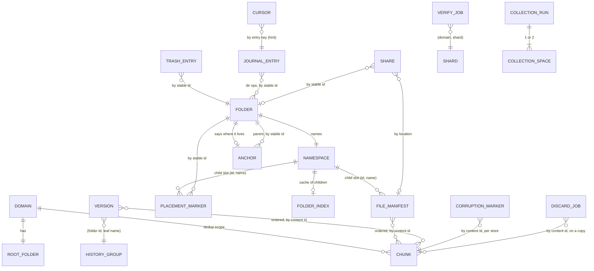

# Data model — what a domain stores on its backend

This is the abstract model of the shared object store: the information every client of a domain reads
and writes, how it is organised, and why. It names no byte format, hash function, path spelling or file
name except in §9. An implementation that honours §2–§8 can choose a different encoding (SQL tables, a KV
store with other naming, another content hash) and still be correct.

Concrete formats: [02 §2](../02-remote-model.md#2-concepts--data-model) (keys, manifest bytes, markers,
anchor, trash, index, versions, GC run, corruption), [03 §2](../03-journal-sync.md#2-concepts--data-model)
(journal, cursor), [05 §2.2–2.5](../05-ops-config.md#22-roles) (roles, key space, shares, GC jobs),
[06 §2.5–2.6, §4.3–4.7](../06-backends.md#25-members-and-roles) (members, deferred jobs, bucket jobs),
[01 §2.1–2.4](../01-core.md#2-concepts--data-model) (hashing, chunking). Local state (mirror, cache, WAL,
applied log, deferred job logs) belongs to the local-layout model and appears here only where it defines
what the store owes.

---

## 1. Purpose and the medium

**Purpose.** Hold one user tree (a *domain*) so that any number of clients can lazily read it, write it
concurrently, rename folders cheaply, keep history, and reclaim space — with no server logic beyond the
store itself (an optional bucket function runs integrity checks and queued deletes).

**What the medium offers.**

- Named objects with opaque byte bodies; each write is **atomically visible** (absent or whole).
- Read whole, read a byte range, existence probe, delete (single and batched), server-side copy.
- Listing by name prefix, returning name, size, modification time and (usually) an entity tag.
- **One arbitration primitive: create-if-absent**, answering the body that holds the name afterwards.
- On a filesystem store only: rename within the tree, and an advisory file lock.

**What it lacks.** No multi-object transaction, no read-your-listing consistency guarantee across
objects, no ordering of listings (filesystems), no compare-and-swap on an existing object, no server-side
triggers except object-created notifications to the bucket function, and rate limits on repeated writes
to one name (~1/s).

**Who shares it.** Every client of the domain (desktop daemons, one-shot CLI commands, mounts, mobile
apps, an http-proxy that re-exports a domain), the collector (one per machine that sees the main as a
filesystem), the bucket function (per object store), and the share server. They never talk to each
other; the store and the journal are the only channels.

**Scope of one layout.** One domain = one abstract layout. A physical store may hold many domains side by
side; a domain may be spread over several stores (*members*), each holding a copy of the same abstract
layout at a different degree of completeness (§5.3).

---

## 2. Entities

Notation: *identity* = what makes two instances the same object; *mutability* is one of **immutable**,
**replaced whole** (last writer wins), **create-if-absent** (first writer wins), or **appended** (new
objects added, existing ones immutable).

### 2.1 Domain

- **Represents** one synchronised tree and everything needed to operate it.
- **Identity** its name, unique within a store. Every other entity is scoped by it (directly, or as a
  sibling tree keyed by domain name, §2.16–2.19).
- **Attributes** none stored; configuration (members, chunk size default, versioning) is local to each
  client.
- **Lifecycle** exists once any object under it exists; dropped by deleting its scoped prefixes.

### 2.2 Chunk

- **Represents** a contiguous slice of a regular file's bytes.
- **Identity** the content hash of its bytes (a 128-bit digest). Two chunks with equal bytes are the same
  chunk. Any reader can verify a chunk against its identity.
- **Attributes** the bytes. Length is implicit.
- **Mutability** immutable in meaning; a re-put writes the same bytes (idempotent).
- **Cardinality** one per distinct slice content **per domain** (dedup scope = domain). The empty body is
  a chunk (every empty regular file names it).
- **Lifecycle** created by any uploading client before the manifest that names it; never updated;
  deleted only by the collector (§8) — directly on the main, by delete request on copies.

### 2.3 File manifest (a *file version* as stored at its live location)

- **Represents** the current content of one regular file or symlink at one place in the tree.
- **Identity** its **location**: (containing folder id, leaf name). Not its content: two files with equal
  bytes are two manifests naming the same chunks.
- **Attributes** logical size; modification time; chunk size used to cut it; ordered list of chunk ids
  (index *i* covers bytes `[i·chunk_size, …)`); a whole-file digest derived from the ordered chunk ids and
  lengths (so a partial rewrite recomputes it without rereading unchanged bytes); the leaf name as
  recorded at write time; for a symlink, the target and no chunks.
- **Mutability** replaced whole (last writer wins; conflicts are resolved above the store, via the
  journal).
- **Recorded name** is informational: the location is authoritative. It exists because some places a
  manifest body is copied to (versions, trash walk, share, cache) cannot yield the name back.
- **Lifecycle** created/replaced on publish; moved on file rename (copy to the new location, delete the
  old, then re-put so the recorded name matches); deleted on file delete (its prior bodies survive as
  versions, §2.9, when versioning is on); deleted with its folder when a trashed folder is purged.

### 2.4 Folder

- **Represents** a directory, independent of where it sits.
- **Identity** a **stable folder id**, minted by a client (unique by construction: client prefix + local
  counter) and made final by a claim (§2.6). Never reused, never changed; survives rename and move.
- **Attributes** none on its own; it is the name of a **namespace** (§2.5) and the subject of one
  **anchor** (§2.7).
- **Reserved ids** the **root** (the domain's top folder; no marker, no anchor, always exists) and the
  **trash** (a namespace of trash entries, §2.8; never a real folder).
- **Lifecycle** comes into being with its winning claim; ends when a purge deletes its contents (see §10
  for what is left behind).

### 2.5 Namespace

- **Represents** the set of direct children of one folder: file manifests and placement markers, plus
  the folder's own anchor and folder index.
- **Identity** the folder id.
- **Child identity** (folder id, leaf name). A file and a folder of the same name in the same folder
  share one child slot; the object there is one or the other, classified by its body.
- The namespace is not an object; it is the set of objects sharing the folder id. Listing it is the
  authoritative way to learn a folder's children.

### 2.6 Placement marker (claim)

- **Represents** "the folder with id *I* appears in folder *P* under name *N*".
- **Identity** its location (*P*, *N*) — the same child slot a manifest would take.
- **Attributes** *I* and *N*.
- **Mutability** **create-if-absent**: writing it *is* the claim of the name. The first writer wins; a
  loser adopts the winner's id (its local candidate id is discarded and its content is filed under the
  winner). An explicit mkdir or a move writes it plainly after its anchor (the id is already settled).
- **Lifecycle** created by the first client to publish into or create the folder at that name; deleted
  when the folder moves away or goes to trash; a stale one (disowned, §2.7) may be deleted by any
  claimant that finds it in its way, or by integrity repair.

### 2.7 Anchor

- **Represents** where a folder says it lives: (parent id, name), or "in trash".
- **Identity** the folder id (exactly one per folder, stored inside the folder's own namespace).
- **Mutability** replaced whole.
- **Role** it arbitrates between markers. A marker at (*P*, *N*) naming *I* is **filed** iff anchor(*I*) =
  (*P*, *N*), or *I* has no anchor (data from before anchors existed, taken at its word). Otherwise the
  marker is **disowned** and every reader ignores it. This makes a move one authoritative write even if
  the old marker's delete is lost.
- **Lifecycle** written when a claim is won (after the marker), before the marker on explicit mkdir and on
  every move/rename/trash/restore; not deleted by purge today (§10).

### 2.8 Trash entry

- **Represents** a deleted folder awaiting expiry or restore.
- **Identity** a random id in the trash namespace (one per deletion; the same folder deleted, restored and
  deleted again gets two entries).
- **Attributes** folder id, name, and the domain-relative path at deletion time (for listing and
  restore).
- **Mutability** immutable.
- **Lifecycle** created by folder delete (before the anchor moves to trash and before the live marker is
  deleted); deleted by restore (after the folder is re-placed) or by expiry/purge (after the subtree).
  The folder's subtree is untouched while trashed: unreachable from root, still intact.

### 2.9 Version

- **Represents** a previous body of a file manifest.
- **Identity** (history group, timestamp). The **history group** is the manifest's location (folder id,
  leaf name) — so history follows a folder rename but not a file rename.
- **Attributes** the old manifest body verbatim (hence the recorded name, used to name a deleted file).
- **Mutability** immutable; **appended** per group.
- **Lifecycle** created, when versioning is on, immediately before a manifest is replaced, deleted, or
  renamed away (best effort: a failed snapshot does not block the write). Deleted by expiry by age.
- **Derived notion** a *deleted file* = a history group with versions and no live manifest at its
  location.

### 2.10 Journal entry

- **Represents** one unit of work a client published: an ordered batch of ops (put, delete, mkdir, rmdir,
  rename) naming domain-relative paths and, for directory ops, folder ids.
- **Identity** entry key = (start time in ms, client id). Total order by (time, client id); not a causal
  order.
- **Mutability** immutable; the journal is **appended** (by many writers concurrently, and visible out of
  key order).
- **Lifecycle** written after the store half of the work (manifest, markers) exists; deleted by expiry by
  age, except the entry the cursor names. Readers dedupe by key against what they have handled; they
  never read "since a key".
- **Partitioning** by month of the key, only to bound listing sizes.

### 2.11 Cursor

- **Represents** a hint: "some writer recently published entry *K*".
- **Identity** one per domain.
- **Mutability** replaced whole, debounced, last writer wins; may move backwards or be lost.
- **Role** lets idle readers watch one object instead of listing the journal; a periodic sweep covers
  every bump it loses. Also the object the write guard probes to learn whether the main is online.

### 2.12 Folder index

- **Represents** a cache of a namespace's child bodies, each tagged with the entity tag the store
  reported for it.
- **Identity** the folder id (one per namespace).
- **Mutability** replaced whole; written only by full walkers allowed to write; nothing on the write path
  maintains it.
- **Validity** an entry counts only if the live listing reports the same tag for that child; otherwise
  the child is read. Meaningless on any store but the one whose tags it recorded.
- **Lifecycle** rewritten when coverage drops below a threshold; deleted with its namespace on purge.

### 2.13 Collection run (GC run state)

- **Represents** an open chunk collection on the main: phase (opening, marking, abandoning, closing),
  start time, and progress cursor (last finished namespace or shard, by name).
- **Identity** one per domain, **on the main only** (never on copies).
- **Mutability** replaced whole; the phase is recorded *before* the step it names.
- **Effect on readers** its presence means chunks live in **two collection spaces** (§2.14).
- **Lifecycle** created by `gc` start; advanced per unit; deleted at the end of close or abandon.
  Exclusion between collectors is a per-machine lock beside it, not a store object.

### 2.14 Collection space

- **Represents** a named set of chunks. Normally one (the *surviving* space). During a run there are two:
  the *surviving* space (where writers keep writing and where marking moves live chunks) and the
  *outgoing* space (everything that existed when the run opened, not yet proven live).
- **Identity** (domain, space); a chunk's identity is unchanged by which space holds it.
- **Lifecycle** the outgoing space is created by renaming the whole surviving space at open, drained by
  marking (moves) and closing (deletes), and removed at finish; abandon moves everything back.

### 2.15 Corruption marker

- **Represents** "this store's copy of chunk *C* is bad" (wrong hash with computed digest and size, or
  unreadable with a reason, and a time).
- **Identity** (domain, chunk id) **per store**: a marker describes the chunk bytes of the store it sits
  on, not the abstract chunk.
- **Mutability** replaced whole; the existence is the finding, the body optional detail.
- **Lifecycle** filed by the local driver after verifying a write, by the bucket function on every chunk
  creation and verify job, by a collection run with verification. Cleared by a good rewrite of the chunk
  (the checker deletes the marker before re-checking), by the collector when it discards the chunk.
- **Effect** an uploader never deduplicates against a marked chunk: it re-sends the bytes.

### 2.16 Verify job

- **Represents** a request to the bucket function: check every chunk of one shard of one domain.
- **Identity** (domain, shard); one per shard, all shards requested at once.
- **Lifecycle** created by `data-integrity --verify`; deleted by the function after it finishes the shard
  (last, so a crashed check leaves evidence). Findings are corruption markers.

### 2.17 Discard job

- **Represents** a request, placed on a *copy*, to delete a list of chunks (and their markers).
- **Identity** (domain, collection run, last shard of the batch). The run in the identity stops a later
  collection from overwriting an unconsumed request.
- **Lifecycle** created by the collector's close phase on each deferred member that supports queued
  deletion; consumed and deleted by the bucket function (left in place if any key was refused);
  re-sent manually (`gc --retry-jobs`); never retried automatically.

### 2.18 Share

- **Represents** a public, expiring link to one file or one folder.
- **Identity** a random token; **not scoped by domain** (one shared tree per store, so IAM and lifecycle
  rules take one literal prefix); the body names its domain.
- **Attributes** domain, expiry, type, display filename, and a reference: for a file, the manifest's
  **location**; for a folder, its **folder id**.
- **Placement** on **one member** (the first readable one advertising a share endpoint), written
  directly, not through the domain's composite.
- **Lifecycle** created by `share`; nothing deletes it (expiry is enforced at read).

### 2.19 Share artifact cache

- **Represents** assembled bytes (a whole file, or a folder zip) the share server built.
- **Identity** a file served by path: the whole-file digest; a download: the token (frozen at first
  download).
- **Derived** entirely from chunks and manifests; dropped by `share --clear-cache`.

### 2.20 Deferred debt (not a store object)

What a replica or backfill member *owes* relative to the main is recorded client-side, per (domain,
member), as an ordered log of **bodyless** jobs: put *key*, copy *src→dst*, delete *key(s)*. The job
names what changed; the body is re-read from the mains at execution time. It is listed here because it
is the only record of how a copy differs from the main; it is not replicated and not visible to other
clients.

---

## 3. Relations

| From → to | By | A dangling reference means |
|---|---|---|
| manifest / version → chunk | content id | Crash-consistency violation, or loss (collector bug, F1/F2), or a copy behind its debt. A read fails with "missing" — never silently substituted. |
| marker → folder | stable id | The folder's namespace may be empty (a newly claimed folder with no children yet): legal. |
| anchor → parent folder | stable id | Parent moved to trash or purged: the folder is unreachable; integrity reports it. |
| trash entry → folder | stable id | Folder restored or re-filed elsewhere (anchor disagrees): the entry is stale and must **not** be purged; skipped loudly. |
| journal op → path / folder id | name + stable id | Normal: the store has moved on. Resolution tables in the sync layer decide (apply, conflicted copy, step aside). |
| cursor → journal entry | entry key | Entry expired: harmless (expiry spares the named one to avoid it). |
| share → manifest location | (folder id, leaf) | File renamed or deleted: link 404s. Folder renamed: link survives. |
| share → folder id | stable id | Folder moved, renamed or trashed: link still serves it until purge. |
| folder index entry → child | location + tag | Tag mismatch or child gone: entry ignored. |
| corruption marker → chunk | content id | Chunk gone: marker is stale; the collector and the function delete markers with the chunks they reclaim. |
| discard job → chunk | content id | Chunk already gone: delete of an absent object succeeds. |

The **path of a file** is not stored anywhere as a unit: it is the chain root → marker → … → manifest
location, resolved by one read per segment, each validated by the target folder's anchor. Only the trash
entry (path at deletion), journal ops and share filenames record paths, as history or display.

---

## 4. Invariants

### 4.1 At rest (after every writer has finished or its local debt is paid)

1. **Referential completeness of content.** Every chunk id named by a manifest or version exists (in
   some collection space during a run) on every member that holds that manifest or version.
2. **Content identity.** A chunk's bytes hash to its id — except where a corruption marker on that store
   says otherwise.
3. **One placement per folder.** For each folder id, at most one filed marker exists: the one at its
   anchor's (parent, name). Other markers naming it are disowned.
4. **One occupant per child slot.** A (folder id, name) slot holds either a manifest or a marker.
5. **Reachability.** Every live folder is reachable from root through filed markers; every trashed folder
   is named by at least one trash entry whose folder's anchor says "in trash".
6. **Journal after state.** A journal entry exists only for work whose store half is already visible
   (manifests, markers). Readers may apply it immediately.
7. **Cursor names a published entry** (or is absent).
8. **Collection closure.** If no run is open there is exactly one collection space. If a run is open, a
   chunk named by any manifest or version already marked is in the surviving space.
9. **Copies never hold unverifiable state.** A non-main member is written only while every main is
   reachable; a copy receives only what a main already took.
10. **Replica file completeness.** A manifest reaches a replica or backfill only after every chunk it
    names is confirmed there ("partial coverage, never partial files").

### 4.2 Temporarily violated, and who repairs

| Violation | During | Repaired by |
|---|---|---|
| Orphan chunks (no manifest names them) | upload crashed or cancelled before the manifest | Next collection. Harmless meanwhile (a successor reuses them). |
| Marker without anchor | a won claim before its anchor lands | Readers treat it as filed; the claimant writes the anchor; integrity repair writes a missing one. |
| Folder unreachable (anchor moved, new marker not yet written) | folder move/rename | The mover's queued op retries (local WAL). |
| Two filed-looking markers | never, by construction: the anchor decides | — |
| Old marker still present after move | lost delete | Disowned by the anchor; deleted by the next claimant of that slot or integrity repair. |
| File at old and new path | file rename (copy then delete) | Mover's queued op; the recorded name catches up with a re-put. |
| Journal entry missing for visible work | crash between publish and journal put | The writer's local WAL (`executed` state) republishes under the original key. |
| Trashed folder whose anchor is live | lost step of a restore | Expiry skips it loudly; integrity repair. |
| Chunk in the outgoing space while referenced | a GC run between open and marking of its namespace | Marking, or the writer's promotion before publishing. |
| Copy behind the main | always, by design | The member's deferred job log. |
| Folder index stale | any child write | Readers validate per entry; the next full walk rewrites. |
| Corruption marker for a good chunk | spurious finding, or a rewrite not yet re-verified | Re-verification (the checker deletes then re-checks). |

### 4.3 Ordering rules (crash consistency)

The atomicity unit is one object. Every multi-object change is ordered so that a crash at any point
leaves either the old state, the new state, or a state a reader classifies safely.

1. **A referrer is written after everything it references exists**: chunks before manifest; manifest
   and markers before the journal entry; journal entry before the cursor bump; on a copy, chunks before
   the manifest.
2. **Promotion before reference**: during a collection run, every chunk a manifest names is moved into
   the surviving space before the manifest is written.
3. **Authority before evidence**: the anchor is written before the marker it validates (mkdir, move,
   trash, restore); the trash entry before the anchor says "in trash", before the live marker is deleted.
4. **Old version before overwrite**: the version snapshot is taken before a manifest is replaced,
   deleted or renamed away.
5. **Namer deleted last**: a purge deletes the subtree before the trash entry that names it (a violation
   in `expire` is noted in §10).
6. **State before step**: a collection records its phase before performing it, and its progress after
   each finished unit; every step is idempotent.
7. **Copies before the main**: a collection deletes (or durably queues deletion) on copies before
   discarding the main's outgoing space, so a crash repeats deletes rather than leaking them.

---

## 5. Ownership and concurrency

### 5.1 Writers per entity

| Entity | Writers | Arbitration |
|---|---|---|
| Chunk | any client (uploads), deferred workers (copies), integrity repair (one member) | none needed: same name ⇒ same bytes |
| Chunk deletion | the collector only | per-machine lock on the main; delete-by-name of what remains outgoing |
| File manifest | any client | **last writer wins**; conflicts detected in the journal layer, loser renamed by the *second* publisher |
| Placement marker | any client | **create-if-absent** (claim). On a store that cannot arbitrate: plain write, one warning, the race returns |
| Anchor | the client that won the claim, or that moves/trashes/restores the folder; integrity repair | last writer wins |
| Trash entry | the deleting client; restore and expiry delete it | unique random identity |
| Version | the client replacing/deleting/renaming a manifest | unique timestamp identity |
| Journal entry | each client its own keys | unique (time, client id); immutable |
| Cursor | any publishing client | last writer wins, debounced; correctness never depends on it |
| Folder index | full walkers allowed to write | last writer wins; validated per entry at read |
| Collection run, collection spaces | one collector per machine (lock), main only | lock + in-process flag; not safe for two machines sharing a main over a network filesystem |
| Corruption marker | the store's own checker (local driver, bucket function), a verifying collector | checker deletes before re-checking |
| Verify / discard job | the client asking | consumed by the bucket function |
| Share, share cache | the sharing client; the share server | unique token; cache is rebuildable |

### 5.2 What readers may observe mid-change

- An object mid-write is absent or whole, never partial. A child that is listed but unparseable is a
  write in flight: skipped, not failed (except for the collector, which aborts rather than discard).
- A child listed but gone on read is a *permanent* miss: a deleter must not mistake it for absence of
  the whole folder.
- Journal entries appear out of key order; a reader lists the whole window and dedupes.
- During a run, a chunk may be in either space; readers look in both, then re-check the run state before
  answering "absent".
- A manifest may reference chunks a copy does not yet hold (copy behind); readers of that copy fail over
  only when the main is unreachable, never on a miss.

### 5.3 Members: mains, replicas, backfills, archives

All members of a domain hold the **same abstract layout**; they differ in which entities they carry and
how current they are.

| Member | Written | Read | Carries | Relation to the main |
|---|---|---|---|---|
| **main** (≥1) | every write, synchronously; a write returns when all mains have it | first main is the read primary; a miss there is authoritative | everything; the only home of collection run state and outgoing space | source of truth |
| **replica** | every write, deferred through the durable job log; chunks may be forwarded eagerly (best effort) | only when no main is reachable | everything except folder indexes and collection state | a lagging **prefix-closed subset**: at most the main's state as of its debt; may hold extra chunks (queued discards not yet consumed, forwards whose manifest never came) |
| **backfill** | same as replica, starting from empty | never | content only: no journal, no cursor, no indexes | same as replica, minus history-of-work; promoted to replica by one config word after a full mirror |
| **archive** (read-only) | never | on a source-of-truth miss or when it is unreachable; every archive asked | *different* content (a frozen or foreign copy of the same layout) | independent |

Consequences:

- **Per-member entities.** Corruption markers, verify jobs and discard jobs describe one store's bytes and
  live on that store. The folder index describes one store's entity tags and is disabled when a domain
  has more than one readable member.
- **Copies re-read from mains only.** A deferred job fetches bodies from the mains, never from another
  copy, so a stale body is never propagated and then forgotten.
- **Write guard.** No copy is written directly (mirror, repair, verify) while a main is unreachable;
  otherwise it would hold state nobody can check.
- **Mirror** (member → member) is additive: it copies what the destination lacks or holds at a different
  size, never deletes, and excludes indexes. It does not order chunks before manifests within a run
  (see §10).

### 5.4 Multi-domain

- **Dedup scope is the domain.** Identical chunks in two domains are stored twice, so a domain can be
  dropped by prefix without reference counting across domains.
- **Siblings, not children.** Corruption markers, verify jobs and discard jobs are keyed by domain name
  in trees beside the domain trees (so the bucket function and lifecycle rules can target them by one
  prefix); shares are one store-wide tree. Dropping a domain means dropping its own tree and those three
  sibling trees; shares pointing into it simply go dead.
- **Names collide.** A domain named like one of the sibling trees would overlap it (unchecked, §10).

---

## 6. Arbitration of folder identity

Folders are the one place where independent clients must agree on a single answer (which id a name
denotes) through a store that has no transactions. The protocol has four parts: mint without
coordination, claim with create-if-absent, settle with anchors, move with one authoritative write.

### 6.1 Minting: unique without coordination

- A folder id is (client identity, counter). The client identity is random and shared by every process
  of one client; the counter is drawn from blocks each process leases locally by exclusive file
  creation, so two processes of one client never draw the same value.
- **Guarantee**: ids are globally unique with no store round trip and no wait (up to the probability of
  two clients drawing the same random identity prefix). Uniqueness is all minting provides: a minted id
  is only a **candidate**. It says nothing about which id a *name* denotes; two clients creating
  `Photos` offline mint two different candidates for one intended folder.
- **Store capability**: none.

### 6.2 Claiming: one name, one id

- To publish into a folder, a client needs the folder's id to be the one the store accepts for that
  name. Parents are claimed first, root-down, so every claim names a slot under an agreed parent id.
- The claim writes a placement marker (candidate id, name) at the child slot (parent id, name) with
  **create-if-absent**. The store answers the marker that holds the slot afterwards:
  - ours ⇒ **held**; the winner then writes the folder's anchor (parent id, name);
  - another id, filed there (§6.3) ⇒ **taken**: the client adopts the winner's id, discards its candidate,
    and files its content under the winner (a folder that must stay distinct is set aside under a
    conflicted-copy name, which is claimed afresh);
  - another id, disowned ⇒ the marker is stale: the client deletes it and claims again.
- A claim on a slot that already names our id is held (idempotent). An id, once held, never changes: it
  can be handed to frontends and persisted locally.
- **Store capability**: create-if-absent that is **linearizable per name** and returns the holder's
  body. A transient failure is retried; a store that refuses the operation degrades, with one warning, to
  a plain write (last writer wins) and the race returns.

### 6.3 Settling: the anchor decides

Several markers may name one folder: a move whose old-marker delete was lost, a crash between steps, a
claim racing a move. The folder's **anchor** — one object inside the folder's own namespace, (parent id,
name) or "in trash" — is the single authority:

- A marker at (P, N) naming I is **filed** iff anchor(I) = (P, N). It is **disowned** otherwise and every
  reader (tree walk, path lookup, claim, trash expiry, integrity) treats it as absent.
- A marker whose folder has **no anchor** is taken at its word. This covers data written before anchors
  existed and the window between a won claim and its anchor write.
- Consequence: at most one filed marker per folder at any time, whatever deletes were lost, so a folder
  never appears at two paths. Disowned markers are litter: the next claimant of that slot or integrity
  repair deletes them.
- **Store capability**: read-after-write consistency per object (a reader that sees the new marker must
  also see the anchor written before it).

### 6.4 Moving: one authoritative write

- **Move / rename folder** (P, N) → (P′, N′): write anchor (P′, N′) → write marker at (P′, N′) → delete the
  old marker. The anchor is the commit point: from then on the old marker is disowned whether or not its
  delete lands. The subtree, its namespace and its descendants are untouched, so a move costs three
  objects regardless of size.
- **Trash**: write the trash entry → anchor "in trash" → delete the live marker. **Restore**: anchor (P′,
  N′) → marker → delete the trash entry.
- **Mkdir of an already-held id** (explicit create): anchor first, then marker.
- Destination collisions on a move are checked by the publishing client before it writes (another id
  filed at the target ⇒ set ours aside); the move's marker write itself is a plain write.
- **Store capability**: atomic visibility of single-object writes; plain put and delete.

### 6.5 What readers see mid-move

| Point reached | Reader walking from root sees |
|---|---|
| before the anchor write | folder at the old place |
| anchor written, new marker not yet | folder **nowhere** (old marker disowned, new one absent); descendants intact, reachable again when the mover's queued op retries |
| new marker written, old not deleted | folder at the new place only (old marker disowned) |
| done | folder at the new place |

A path lookup by segment follows the same rule, so a lookup of the old path answers "missing" from the
anchor write on. A client that already holds the id locally keeps reaching the folder's content through
it at every point: ids, not paths, are what frontends and journal ops keep.

### 6.6 What a store must guarantee

1. **Create-if-absent, linearizable per name**, returning the body that holds the name afterwards — and
   honestly refusing when it cannot arbitrate, so the client knows it is running unarbitrated.
2. **Atomic visibility** of each object write (absent or whole).
3. **Read-after-write per object** for markers and anchors (listings may lag).
4. Plain put and delete; nothing else. No listing, rename, copy or lock is needed by the protocol.

**Violation — [G5](../findings.md#g5--put_if_absent-against-an-older-http-proxy-server-reads-as-won).**
An http-proxy server older than the claim support ignores the create-if-absent request, performs a
plain write that **overwrites the real winner's marker**, and answers an empty body that the client
reads as "held". Guarantee 1 is broken in both halves: the write is not conditional, and the answer
neither names the holder nor admits refusal. No capability advertises claim support, so the client
cannot detect it. Effect: two clients each believe they own the name and file content under different
ids; one subtree is stranded (its marker overwritten, its anchor pointing at a slot naming another id,
so it is unreachable).

Two further gaps in the protocol as implemented (see §10): a move's marker write and the deletion of a
stale marker are not conditional, so a claim racing either can be overwritten or deleted after it won.

---

## 7. Derived vs authoritative

| Entity | Status | Rebuilt from |
|---|---|---|
| Chunk, file manifest, placement marker, anchor, trash entry, version | **authoritative** | — |
| Journal entry | authoritative *as history of work*; the tree does not depend on it | — (a client that cannot bridge a gap resyncs from the tree) |
| Cursor | **hint** | newest journal entry |
| Folder index | **cache** | namespace listing + child reads |
| Whole-file digest in a manifest | derived | its chunk ids and lengths |
| Recorded name in a manifest | derived (informational) | its location |
| Paths in trash entries, journal ops, shares | historical | tree walk (for current path) |
| Collection run | authoritative *about a run in progress* (it decides where chunks are) | — |
| Corruption marker | authoritative finding until re-checked | re-verification of the chunk |
| Verify / discard job | request | re-issued by the client |
| Share | authoritative | — |
| Share artifact cache | cache | chunks + manifests |
| Deferred debt (local) | authoritative for what a copy owes; lost debt ⇒ degraded copy | a full mirror from the main |

---

## 8. Growth and reclamation

| Grows with | Bounded / reclaimed by |
|---|---|
| Chunks: every distinct slice ever uploaded | The collector (filesystem main only): marks from **every namespace present** (live, trashed, orphaned) and every version; what remains outgoing is deleted on the main and on copies. No collector for an object-store main: `expire` trims history only. |
| Manifests and markers: the live tree | User deletes. |
| Versions: every overwrite/delete/rename when versioning is on | `expire` by age. |
| Trash entries and trashed subtrees | `expire` by age of the entry, or `purge`; skipped when the folder's anchor says it is live. |
| Journal entries: every unit of work | `expire` by age, sparing the entry the cursor names. A client offline longer than the window must full-resync. |
| Folder index | one per namespace, capped in children and size. |
| Corruption markers | cleared by good rewrites and by discards; a marker on a bad chunk nobody rewrites persists. |
| Verify jobs | at most one per shard per domain per store; consumed. |
| Discard jobs | consumed by the function; unconsumed ones persist and are only reported. |
| Shares | **unbounded**: expired shares are never deleted. |
| Share cache | manual clear. |
| Disowned markers | the next claim of the slot, or integrity repair. |
| Orphan namespaces (unreachable folders) | **none**: integrity reports them, nothing deletes them, and they keep their chunks alive. |
| Anchors of purged folders | **none** today (§10). |

---

## 9. Mapping to the current encoding

This is the only place concrete names appear. `D` = domain name, `sss` = first three hex characters of a
chunk id (4096 shards).

| Abstract entity | Concrete representation | Spec |
|---|---|---|
| Domain scope | prefix `tsync/D/` (plus siblings below) | [02 §2.3](../02-remote-model.md#23-backend-key-layout-everything-a-domain-puts-on-a-store), [05 §2.3](../05-ops-config.md#23-key-space-object-naming-on-a-backend) |
| Chunk id | dual-seed XXH3-64 of the bytes, `<16hex>-<16hex>` | [01 §2.1](../01-core.md#21-content-hashing-xxh3-64-dual-seed--exact), [02 §2.1](../02-remote-model.md#21-hashes) |
| Chunk | `tsync/D/chunks/sss/<chunkid>`; size default 8 MiB | [02 §2.2–2.3](../02-remote-model.md#22-chunking) |
| Folder id | `<12 hex of client uuid>-<hex counter>`; reserved `.tsync-root`, `.tsync-trash` | [02 §2.5](../02-remote-model.md#25-folder-ids), [03 §2.1](../03-journal-sync.md#21-client-identity) |
| Namespace | prefix `tsync/D/manifests/<folderid>/` | [02 §2.3](../02-remote-model.md#23-backend-key-layout-everything-a-domain-puts-on-a-store) |
| Child slot (folder id, name) | `…/manifests/<folderid>/<dual hash of leaf name>` | [02 §2.4](../02-remote-model.md#24-two-key-types) |
| File manifest | binary `tsyncm03` body at the child slot | [02 §2.6](../02-remote-model.md#26-manifest-file-body--binary-tsyncm03) |
| Placement marker | JSON `{"dir":true,"name","id"}` at the child slot | [02 §2.7](../02-remote-model.md#27-folder-marker-json) |
| Anchor | JSON `{"parent","name"}` at `…/manifests/<folderid>/.tsync-parent` | [02 §2.8](../02-remote-model.md#28-anchor-json) |
| Trash entry | JSON marker + `"path"` at `…/manifests/.tsync-trash/<16hex>` | [02 §2.9](../02-remote-model.md#29-trash-marker-json) |
| Folder index | binary `tsyncidx1` at `…/manifests/<folderid>/.tsync-index` | [02 §2.10](../02-remote-model.md#210-folder-index-binary-tsyncidx1) |
| Version | manifest body at `tsync/D/versions/<folderid>/<leafhash>/<unix ns>` | [02 §2.11](../02-remote-model.md#211-versions) |
| Journal entry | NDJSON at `tsync/D/journal/<YYYY-MM>/<13-digit ms>-<client uuid>` | [03 §2.2–2.4](../03-journal-sync.md#22-entry-key--the-name-of-one-unit-of-work) |
| Cursor | text entry key at `tsync/D/cursor` | [03 §2.5](../03-journal-sync.md#25-cursor-backend) |
| Collection run | JSON `{"phase","started","cursor"}` at `tsync/D/gc-run`; lock file `gc-run.lock` beside it (filesystem) | [02 §2.12](../02-remote-model.md#212-gc-run-marker-json), [05 §4.9](../05-ops-config.md#49-gc-copying-collector-over-a-local-main) |
| Collection spaces | surviving `tsync/D/chunks/`, outgoing `tsync/D/chunks.from/` | [02 §4.9](../02-remote-model.md#49-garbage-collection-mark-by-move) |
| Corruption marker | JSON at `tsync/corrupted/D/sss/<chunkid>` | [02 §2.13](../02-remote-model.md#213-corruption-marker-json-and-job-bodies), [06 §4.7](../06-backends.md#47-corruption-markers--lifecycle) |
| Verify job | empty object at `tsync/verify-jobs/D/sss` | [06 §4.6](../06-backends.md#46-server-side-work-through-the-bucket-verify-and-discard) |
| Discard job | newline-separated keys at `tsync/gc-jobs/D/<run ms>/<last shard>` | [05 §2.5](../05-ops-config.md#25-ops-data-types-persistent-formats), [06 §4.6](../06-backends.md#46-server-side-work-through-the-bucket-verify-and-discard) |
| Share | JSON at `tsync/shares/<32hex token>` | [05 §2.5, §4.11](../05-ops-config.md#411-share) |
| Share artifact cache | `tsync/shares/cache/<token>.data`, `…/cache/<h1>-<h2>.data` | [05 §4.11](../05-ops-config.md#411-share) |
| Members and roles | config `role`: `main`, `replica`, `backfill`, `readOnly` | [05 §2.2](../05-ops-config.md#22-roles), [06 §2.5](../06-backends.md#25-members-and-roles) |
| Deferred debt | local `<data_dir>/deferred-pending/D/<member>/` job records | [06 §2.6, §4.4](../06-backends.md#44-deferred-targets-replica-and-backfill) |
| Internal-name sentinel | every internal leaf starts `.tsync-` | [02 §2.3](../02-remote-model.md#23-backend-key-layout-everything-a-domain-puts-on-a-store) |

---

## 10. Open questions

1. **Collection vs writers (F1, F2).** Invariant 4.1.8 depends on every writer promoting before
   publishing. A writer checks for an open run once, before the manifest put (F1), and a writer reaching
   the main through an http-proxy cannot promote at all (F2). Both let a deduplicated chunk be reclaimed
   while a new manifest names it. The model needs promotion to be either atomic with the reference or
   performed by whoever owns the filesystem.
2. **Collector exclusion is per machine.** Two hosts sharing a filesystem main over a network filesystem
   could both advance one run ([02 §9.10](../02-remote-model.md#9-open-questions--inconsistencies)).
3. **Expiry deletes the trash entry with, not after, its subtree.** `Retention.expire` lists each entry's
   key *before* its subtree and deletes in batches whose inner order is unspecified, so a crash can
   remove the namer first and orphan the subtree (§4.3 rule 5). `purge_trashed` puts it last, as the
   rule requires (`lib/domain/ops/retention.ml`).
4. **Purge leaves anchors behind.** A purge deletes the child objects and indexes a tree walk yields,
   but no walk yields an anchor, so each purged folder leaves a one-object namespace forever. It is an
   orphan that integrity reports and nothing reclaims.
5. **Orphan namespaces are GC roots.** The collector marks every namespace present, not every reachable
   one, so unreachable subtrees (a move cut short, item 4, lost trash entries) keep their chunks
   forever. Reachability-based marking would reclaim them but would also discard a folder mid-move.
6. **Claim writes the marker before the anchor** (the marker *is* the claim), the opposite of §4.3
   rule 3. The gap is safe only because a marker without an anchor is read as filed; that same rule
   makes pre-anchor data and a half-finished claim indistinguishable.
7. **Unarbitrated stores and unconditional writes around the claim (G5, §6.6).** A store that cannot
   create-if-absent, or an old http-proxy that answers "won" for everyone, turns the claim into
   last-writer-wins and can strand one client's subtree. Two paths bypass arbitration even on a correct
   store: a folder move writes its destination marker with a plain put after a non-atomic "is the name
   free" read, and a claimant that finds a disowned marker deletes it unconditionally before claiming
   again, so a concurrent claimant that won the slot in between loses its marker
   (`lib/domain/remote/store/store/store.ml`, `claim_name`, `put_folder_marker`). Closing both needs
   either a conditional delete/replace or a move that claims its destination with create-if-absent.
8. **History does not follow file renames.** The history group includes the leaf name, so a renamed file's
   old versions appear as a deleted file ([02 §9.5](../02-remote-model.md#9-open-questions--inconsistencies)).
9. **Mirror ignores rule 4.3.1 on copies.** A member-to-member mirror copies listing entries in parallel,
   so a manifest can land before its chunks; an interrupted mirror leaves a replica violating 4.1.10.
10. **Expired shares are never deleted**, and a folder download's cached zip is frozen at first download
    (acknowledged in `lambda/handler.py`). Shares live on one member, so a replica promoted to main does
    not carry them, and a domain drop does not remove them.
11. **Domain-name collisions** with `corrupted`, `verify-jobs`, `gc-jobs`, `shares` are unchecked
    ([06 §9.8](../06-backends.md#9-open-questions--inconsistencies)).
12. **Lost debt.** Duplicate member names share one debt log (G2), and a mobile app never replays debt a
    killed process left (G7); the copy silently lags until a full mirror.
13. **Journal gap past expiry (F3).** Expiry by age assumes every client reads within the window; the
    daemon never detects that it did not.
