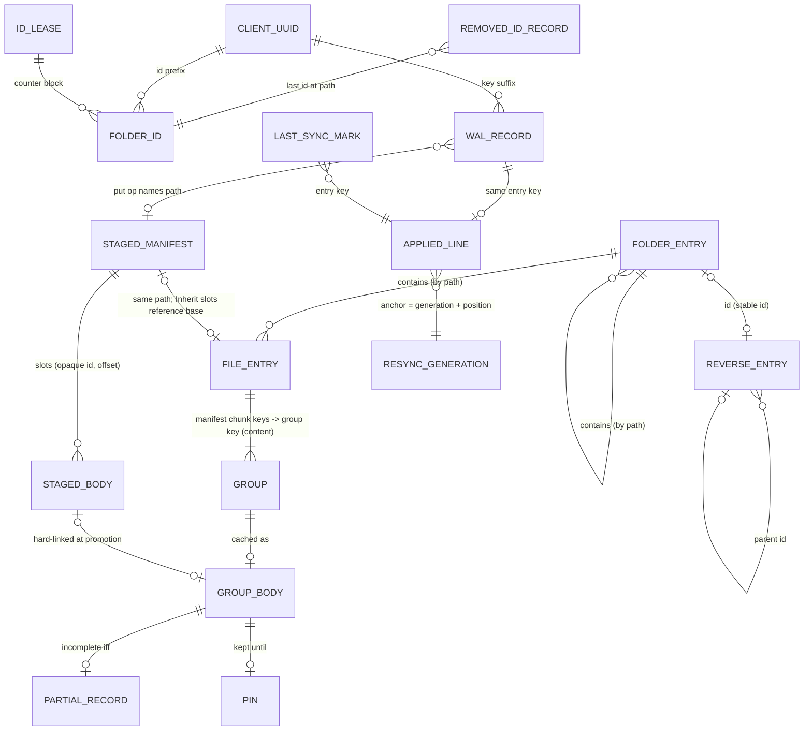

# Data model — local checkout state (one client, one domain)

This file is the abstract model of what one client machine keeps for one domain: everything under the
domain's directory in the cache root, the domain's entries in the data dir, and the client-wide identity
the domain borrows. Sections 1–7 and 9 name no file, path, hash or encoding. Section 8 maps each entity to
its current representation, and the byte-level formats are specified in
[04-checkout-cache.md](../04-checkout-cache.md) §2, [03-journal-sync.md](../03-journal-sync.md) §2,
[05-ops-config.md](../05-ops-config.md) §2 and [07-daemon-cli.md](../07-daemon-cli.md) §2.

An encoding that keeps the entities, identities, invariants and write roles below is correct, whatever it
stores them in: a filesystem tree, an embedded database, or a key-value store.

## 1. Purpose and the constraints of the medium

The backend holds content-addressed chunks and manifests filed under folder ids and name hashes. It cannot
cheaply answer "what is in this folder", "what is this file called" or "what bytes are at offset N", and it
may be unreachable. The local state exists to:

1. answer every namespace question (list, stat, lookup) without the network;
2. serve file bytes lazily, fetching only what a reader touches, within a bounded disk budget;
3. hold the user's unpublished edits, which are the only copy of that data until uploaded;
4. record every unit of owed work before doing it, so a crash never leaves a change that nothing owes;
5. apply peers' changes and feed them, together with this client's own, to frontends as an ordered feed.

**What the medium offers.** A local filesystem, or anything equivalent, that gives:
- atomic whole-object replacement (write aside, then swap in);
- create-if-absent, used for client identity and id leases;
- hard links, not always available (some Android storage lacks them);
- sparse files with positional writes;
- per-object modification times that can be set explicitly;
- advisory whole-file locks that the kernel drops when the holder dies.

**What it lacks.**
- **Durability ordering.** Nothing is fsynced today (F8), so every crash-consistency claim below holds for
  a process crash, not for power loss.
- **Transactions across objects.** Every multi-object change is an ordered sequence of single-object steps.
- **Cross-process locks on most entities** (F7).
- **Reference counting.**

**Who shares it.** On one machine, several processes read and write the same domain state at the same
time: the converging daemon parent, one or more frontend processes, one-shot CLI commands, and the
http-proxy/share server. §5 lists which of them may write which entity.

## 2. Entities

Each entity below is given as:
- **Id**: its identity, meaning what makes two instances the same.
- **Attr**: its attributes.
- **Mut**: its mutability (immutable, replaced whole, or appended).
- **Card**: its cardinality.
- **Life**: its lifecycle (created by, changed by, deleted by, and when).
- **Auth**: whether it is authoritative or a projection (§6).

### 2.1 Namespace mirror — the published tree

This client's projection of the domain's namespace as of the journal entries it has applied.

- **Folder entry**
  - Id: the logical path.
  - Attr: real leaf name, and folder id (absent only for a folder created by a legacy path or not yet
    recorded).
  - A folder may exist in the mirror before it has an id. Operations under a folder with no id are refused
    ("run sync first").
- **File entry**
  - Id: the logical path.
  - Attr: the published manifest, byte-identical to the one on the store, with its recorded name set to
    the entry's leaf.
  - An unreadable manifest counts as absent.
- **Name record**
  - Id: the folder entry it belongs to.
  - Attr: the real leaf of a folder whose storable handle had to be escaped.
  - Only escaped folders have one. A file's real name travels in its manifest.
- Mut: each entry is replaced whole. The tree shape changes by create, move and remove.
- Card: one folder entry per folder the client knows, and one file entry per published file.
- Life:
  - created and replaced by peer application, resync walks, lazy pulls, local mkdir and rename, promotion
    and revert;
  - removed by local delete and rmdir, peer application, the resync sweep and the lazy prune.
- **Full checkout**: a name the mirror lacks is a name the domain does not have. This is the "whole answer"
  invariant, and listings never touch the network.
- **Lazy checkout (Android)**: a name the mirror lacks has not been fetched yet. Listing a folder first pulls
  that folder's children from the store, records them (keeping any id the client already holds), and prunes
  published entries the store no longer names. Three guards apply:
  - a folder with no local id is not pulled;
  - a folder that an owed metadata record touches directly is not pulled, because the pull would undo the
    unpublished change;
  - a pull that cannot read every child fails without pruning.
- Auth: projection (§6), with one exception. A folder's id is final from the moment the client mints it at
  mkdir, and it becomes authoritative once published.

### 2.2 Folder-id index

This entity holds the bidirectional map between stable folder ids and paths. The backend files everything
by folder id, and ops carry ids.

- **Forward** (path → id): the folder entry's own id attribute (§2.1). It is never minted on a read.
- **Reverse entry**
  - Id: the folder id.
  - Attr: parent folder id and leaf name.
  - Resolving an id climbs reverse entries to the root, stops on a cycle, and is accepted only if the path
    it produced maps forward to the same id. A stale entry therefore costs an answer, never a wrong folder.
- **Removed-id record**
  - Id: the logical path.
  - Attr: the last folder id that path named.
  - It outlives the folder, so ops recorded under a removed or moved folder stay nameable, including by a
    process other than the one that removed it.
  - It answers *whereabouts* (Live, Moved, Removed or Unknown).
- Mut: entries are replaced whole.
- Card: one reverse entry per indexed folder. Removed-id records accumulate, one per path that ever held a
  folder.
- Life:
  - written with every folder write, move and reparent;
  - reverse entries are removed by `forget`, `rebuild` and the resync index sweep;
  - removed-id records are never pruned (§7).
- Auth: the reverse index is a projection of the mirror's folder ids and can be rebuilt by walking the
  mirror. Removed-id records cannot be rebuilt, because they are history.

### 2.3 Chunk cache

The chunk cache holds file bytes served locally, organised by the local grouping of stored chunks.

- **Group**
  - A run of `per` consecutive stored chunks of one manifest. `per` is derived from that manifest's own
    chunk size and the configured cache granularity.
  - Id: a digest of its ordered member chunk keys. Two files with identical groups therefore share one body
    and one download. The group key is not (first, last), because two groups can share both ends.
  - Member *i* sits at the sum of the earlier members' sizes.
- **Group body**
  - Id: the group key.
  - Attr: bytes in group layout, possibly sparse.
  - Whole ⇔ the body exists and no partial record accompanies it.
- **Partial record**
  - Id: the group key. At most one per body.
  - Attr: for each member, a single held interval [a,b) of chunk-local bytes, never an interval set.
  - Present ⇔ the body is incomplete.
  - A record that does not parse means "nothing held".
- **Residency** (derived, not stored): a file is online-only, cached or pinned, computed from its manifest's
  groups, their bodies, their partial records and their pins.
- Mut:
  - a whole body appears atomically and is not rewritten thereafter, except by a forced refetch, which
    replaces it whole;
  - a partial body is filled in place by positional writes;
  - partial records are replaced whole.
- Card: bounded by the cap (§7).
- Life:
  - created by reads (range fill or whole-group fetch), read-ahead, materialize, and promotion (hard link
    from a staged body, or a copy when links are unsupported);
  - deleted by the cap, `evict` and `forget`. Deletion is reference-blind: a body another file shares goes
    too, and it is refetched on demand.
- Auth: projection of backend chunks. Any of it can be deleted at any time.

### 2.4 Pins

A pin keeps a body out of cap eviction until a deadline.

- Id: the group key. A pin is attached to content, not to a file, so it follows the content across renames
  and is shared by every file using that body.
- Attr: the deadline.
- Mut: replaced. A re-pin moves the deadline.
- Card: at most one per body.
- Life:
  - created by "make available offline" and materialize-with-keep, after the body exists (a pin needs a
    body to stand beside);
  - removed by unpin, by `forget`, and by the cap once the deadline has lapsed.
- Auth: user intent, but losing it costs only a refetch.

### 2.5 Staged edits

This entity holds unpublished local writes, in a store that neither the cap nor a resync can reach.

- **Staged manifest**
  - Id: the logical path. It uses the same tree shape as the mirror, and wins over the published entry for
    the same path in listings and reads. It is listed even if the file was never published.
  - Attr:
    - real name, authoritative size, mtime and chunk size;
    - either a *whole-body reference* (a file a frontend handed over complete), or one *slot* per chunk:
      **Inherit** (the published manifest's chunk *i*), **Zero** (a hole) or **Staged**(body id, offset);
    - optionally a *commit record*: the manifest the upload produced.
  - Its two states are a type, not a flag. **Owed** means no commit record. **Committed** means the upload
    is done and promotion is pending.
  - Every local mutation produces Owed, which is what retires a pending promotion: the promotion re-reads
    the manifest, finds it Owed, and abandons.
- **Staged body**
  - Id: an opaque random id.
  - Attr: bytes, either in one group's layout (sparse; one body per staged group) or as a whole file.
  - Referenced by (body id, offset) from slots, or by the whole-body reference.
  - A body is only as long as the writes that reached it, and a short tail reads as zeros.
- **Set-aside manifest**: a staged manifest that could not be decoded (a newer version, or torn). It is
  kept under a distinct name, never decoded into something it does not mean, never deleted, and skipped by
  listings and folds.
- Mut: manifests are replaced whole. Bodies are written in place, grown, and resized exactly on truncate
  and before promotion.
- Card: one manifest per locally edited path, and one body per staged group (or one whole body).
- Life:
  - a manifest is created on the first write, truncate, create or whole-file handover, and moved by local
    renames and conflict asides;
  - a manifest is deleted by promotion, discard (local delete, O_TRUNC re-create, peer application's
    remove) or an explicit revert;
  - a body is released when no slot names it any more, after promotion, or by the orphan sweep (unreferenced
    and older than the grace).
- Auth: **authoritative. It is the sole copy of user data.**

### 2.6 Write-ahead log of owed work

One record per unit of work this client owes the store.

- Id: an **entry key**: the start time in milliseconds plus the client uuid. It is totally ordered, and its
  order is replay order. The same key names the work for its whole life:
  WAL record → published journal entry → cursor value → applied-log line → change-feed anchor.
- Attr:
  - ops: the journal vocabulary (put, delete, mkdir, rmdir, rename; directory ops carry folder ids);
  - state;
  - attempt count;
  - last error (kind and detail).
- **Record states**

  | State | Meaning | Set by |
  |---|---|---|
  | Intent | recorded, nothing done yet (metadata: the local half has not run) | `record`, before the local half |
  | Prepared | local half done or data staged; backend half owed | the hand-off to a queue (a put's first state) |
  | Executed | bytes or marker on the store; entry not yet published | discharge, just before publishing the entry |
  | *(no record)* | entry published, cursor noted | discharge deletes the record; there is no Committed state |

  - An unknown state reads as Intent, so a record never claims a state it did not earn.
  - A record with ops and no put is a *metadata record*.
- Mut: replaced whole on each state change, and updated by retargeting (conflict asides rewrite owed renames).
- Card: one per unit of owed work.
- Life:
  - puts are created at close;
  - metadata records are created before the local half;
  - records are deleted by discharge, by reconcile once nothing is left owed, and when the local half
    reports that nothing is owed (for example a rename of a never-published file).
- **Claim**: a per-directory advisory lock. The first process that starts a queue over the log holds it. A
  process rescans the log for others' records only while nobody holds the claim. It gates *recovery reads*,
  not writes.
- Auth: **authoritative. It is the sole record of owed work.**
- Relation to staged edits: a staged manifest with no WAL record is legal. The window runs from the first
  write to close, and startup reconcile *adopts* such manifests with a fresh put record.

### 2.7 Applied-entries log (the change feed)

The journal entries this client has published or applied, in the order it handled them.

- Id of a line: its entry key. **Position, not key order, is the feed order.** An anchor is a position.
- Attr: entry key and ops. It covers four kinds of entry:
  - this client's own published entries, noted before the backend put;
  - peers' entries, noted after all their ops applied;
  - rebuild findings, under freshly minted keys, whose ops are the diff a full resync made;
  - "handled" markers with no ops.
- Mut: append-only, sharded by the month in which the entry was handled. A torn append loses only that line.
- Card: one line per entry handled. Bounded by retention (§7).
- Life:
  - appended by the uploader and metadata queue (own entries), by the poller and `tsync sync` (peer
    entries), and by full resync (findings);
  - pruned by age and total size.
- Readers:
  - the dedupe set, which is loaded once per process (F5);
  - the frontend change feed (`changes_since`), which is never filtered by author;
  - the full-resync decision.
- Auth: authoritative *history* for dedupe (it cannot be rebuilt from the store after the journal is pruned).
  As a feed it is the only source. A lost feed is recovered by the reader re-listing, not by rebuilding the
  feed.

### 2.8 Last-sync mark and resync generation

- **Last-sync mark**
  - Id: one per (client, domain).
  - Attr: an entry key.
  - Moved forward only, during peer application.
  - It has two uses: absent means "never synced" (which disables the dedupe horizon), and it drives the
    `cannot_bridge` test that decides a full rebuild. It is **not** a "list since" cursor.
- **Resync generation**
  - Id: one per (client, domain).
  - Attr: an opaque token (a timestamp).
  - Every change-feed anchor carries it. An anchor from another generation answers "stale", and the reader
    re-lists.
  - Stamped when a frontend asks for a full resync through IPC.
- Both are replaced whole, atomically.
- Auth: both are authoritative bookkeeping. If either is lost, the cost is a full rebuild or a re-list, and no
  data is lost.

### 2.9 Export resume records

- Id: the destination path, one record per destination file.
- Attr:
  - a header that identifies the source content (manifest identity, size, chunk size) and the destination;
  - the set of chunk indices whose bytes are durably written at the destination.
- Mut: append-only indices. A header mismatch makes the record void.
- Life:
  - created and extended by an export (a CLI one-shot);
  - deleted when the export completes, or by the on-demand sweep after a retention period.
- Auth: authoritative only about the destination's progress. Losing it means a full re-export.
- Unlike the rest of the local state, the export path fsyncs each chunk before recording its index.

### 2.10 Kept whole-domain walk (paging)

- Id: a walk id (a timestamp), carried in every `list_all` page cursor as (walk id, line number).
- Attr: a header (walk id, skipped count), then one row per item in path order, each holding path,
  container folder id, kind, size and mtime.
- Mut: replaced whole when a new walk starts. It is never invalidated by later changes, because the change
  feed carries what moved after the anchor.
- Life:
  - written best-effort by the IPC handler of the serving process;
  - lost on resync, because it lives in the scratch area;
  - a missing walk is redone and paging continues at the same line number.
- Auth: disposable projection.

### 2.11 Scratch and temporary objects

- **Frontend scratch**: files a frontend must hold beside the namespace but never publish (FUSE's
  `.fuse_hidden*`), filed by real path, plus the kept walk (§2.10). The whole scratch area is wiped by resync.
- **Temporary objects**: the write-aside half of every atomic replacement. Each carries the owning process
  id, so a sweep can tell a live writer's temp from a dead one's.
- **Listing spools**: machine-wide, not per domain, used by import, mirror and rsync. Their owner is
  identified by pid.
- All of these are disposable and never authoritative.

### 2.12 Deferred-job logs (replica and backfill)

- Id: one log per (domain, target backend name), with one record per job.
- Attr: a *bodyless* job (put key, copy src→dst, delete key or keys). The body is re-read from a main when
  the job runs, so repeated puts converge on the latest body.
- Mut: records are created, then deleted when done. A permanent failure drops the record and marks the
  target degraded.
- Card: bounded at 100 000 per target. Past that the target is degraded.
- Life:
  - recorded by every process that writes to the domain's store;
  - run by the process that holds the log's claim: the daemon parent (resuming) or the one-shot that
    recorded them (its own only).
- Auth: **authoritative: the sole record of replication owed to a target.**

### 2.13 Client identity

- **Client uuid**
  - Id: one per data dir, shared by *all* domains.
  - Created once by a create-if-absent race: the loser adopts the winner's value.
  - Immutable.
- **Folder-id counter lease**
  - Id: the block number.
  - Created by create-exclusive. Owning a block entitles one process to mint the 1024 ids in it (id = uuid
    prefix plus counter).
  - A forked child leases its own block. Leases never block and never contact the store.
- Auth: authoritative.
  - Losing the uuid makes this machine a new client: its WAL records stop being "own" and its folder ids
    change prefix.
  - Losing leases risks duplicate folder ids, which is silent namespace corruption.

### 2.14 In-process state (not persisted, listed for completeness)

These tables live in memory, one per process:
- the manifest memo (bounded FIFO);
- the cache byte and file counts, anchored by one walk;
- the in-flight fetch table;
- the partial-record intervals;
- the per-key and metadata mutexes;
- the dedupe set;
- the WAL hand-offs;
- the cursor debouncer;
- the pull table.

None of them is shared across processes. §5 depends on that fact.

## 3. Relations

The table below gives each reference, how it names its target, and what a dangling reference means.

| From → to | By | Dangling means |
|---|---|---|
| mirror file entry → group | content (member chunk keys → group key) | not cached; fetch on demand. Normal. |
| partial record → body | content (same group key) | the body was taken by the cap; the record means "nothing held" and is reset on the next fill |
| pin → body | content | a pin with no body is inert; the cap drops it when its deadline lapses |
| staged slot → staged body | opaque id + offset | **data loss** for those members: the read and the upload hit ENOENT, and the uploader abandons the record (F9) |
| staged Inherit slot → published manifest | path (the mirror entry at the same path) | a hard error ("inherits nothing"). Zeros are never served as content. |
| staged manifest → WAL record | path, through the record's put op | transient (the file is open, or a crash before close); reconcile adopts it |
| WAL record → staged manifest | path | nothing left to upload: the record completes and publishes no entry |
| WAL rename → path | path | retargeted when a conflict aside moves the destination |
| folder id → path (reverse chain) | stable id | unresolvable until `rebuild`; operations refuse rather than guess |
| removed-id record → folder id | path → id | expected: the id lives on after the folder |
| change-feed anchor → applied line | generation + entry key (position) | the line was pruned or the generation changed: the reader re-lists ("stale") |
| last-sync mark → journal | entry key | the journal was pruned past it: `cannot_bridge` forces a full rebuild (the daemon never checks, F3) |
| kept-walk cursor → walk | walk id + line | the walk is gone: re-walk and continue at the same line |
| deferred job → store object | backend key | the object is gone: the put job is done ("deleted since") |

## 4. Invariants

### 4.1 At rest

1. **Whole body.** A group body is whole ⇔ it exists and has no partial record.
2. **A partial record never claims more than the body holds.**
3. **Staged is unreachable by projection maintenance.** The cap, `evict`, the resync walk and the resync
   sweep never delete staged manifests or bodies. This holds by separation of stores, not by a filter.
4. **Every body a staged manifest names exists** (at least up to the bytes it holds). This is violated today
   in a crash window (F9, §4.2).
5. **Committed means published.** A Committed staged manifest's commit record names a manifest already on
   the store. A local mutation can only produce Owed.
6. **Nothing owed is unrecorded.**
   - Every published-worthy change is covered by either a WAL record or an unrecorded staged manifest that
     reconcile will adopt.
   - A metadata change's record precedes its local effect.
7. **One unit of work, one key.** A WAL record, its journal entry, its applied line and any anchor to it all
   share one entry key.
8. **Folder ids are final and unique.**
   - A folder holds at most one id, and an existing id is never replaced by a browse.
   - Ids are unique across clients (uuid prefix) and across processes (lease).
9. **The reverse index is never trusted without verification.** A path resolved from an id must map back to
   that id.
10. **Mirror completeness** (full checkout only). Absence in the mirror = absence in the domain, as of the
    entries applied.
11. **The last-sync mark is monotone.**
12. **An applied line means done.** An applied-log line for a peer entry exists only after all its ops were
    applied, and a line for an own entry exists only for a record that still exists or whose entry is on the
    store.
13. **Content-addressed names never change content.** This covers group bodies and pins. Bodies with
    opaque ids are rewritten in place only by the process holding that path's per-key lock.

### 4.2 Crash-consistency ordering (abstract)

- **Referent before referrer.**
  - Staged bytes before the staged manifest that names them.
  - Group bodies before the mirror entry that promotion writes.
  - A folder's new marker before removal of the old one.
- **Release a referent only after its last referrer has switched.**
  - Old staged bodies are released only after the new staged manifest is written.
  - Staged bodies are released only after the published entry is written and the staged manifest is removed.
  - Violated in `ensure_group_body`'s slow path and in truncate (F9).
- **Commit before any local move.** The commit record is written into the staged manifest before
  promotion. A crash before it re-uploads identical bytes (dedup makes that free), and a crash after it
  replays only the local moves.
- **Promotion order**: publish groups into the cache (hard link, else copy) → write the mirror entry → delete
  the staged manifest → release the bodies. A concurrent reader finds whichever representation it lands on
  still present, with one retry on ENOENT.
- **Metadata**: record Intent → local half → Prepared (hand-off) → backend half → Executed → publish entry
  → note cursor → delete record.
- **Partial bodies**: write the empty record before the first byte; widen the record only after bytes land;
  on eviction remove the body before the record.
- **Own applied line before the backend put**, and a peer's applied line after its ops. A crash in the
  first case leaves a line for an entry that is published later under the same key.

### 4.3 Temporarily violated (who repairs)

| Invariant / state | Violated during | Repaired by |
|---|---|---|
| mirror completeness | a full-resync walk (stale entries remain until the sweep); lazy checkout always | the sweep, run only after a complete walk; lazy: the next pull of that folder |
| folder index consistency | reparent in progress; crash mid-reparent | verification on read; `rebuild`; the resync index sweep |
| referent-before-referrer for staged bodies | F9 window (not designed) | nothing: data loss |
| unrecorded staged manifest | first write → close; crash before close | startup reconcile (`adopt_unrecorded`) |
| WAL state behind reality | any crash | startup reconcile (§4.6 of 04): HEAD the entry, redo idempotent local halves, resume queues |
| orphan staged body | crash between body creation and manifest write | orphan sweep after the grace |
| orphan temp object | crash mid-replace | temp sweep (dead owner pid; mirror tree only, on demand) |
| cache counts | other processes writing the same cache | re-anchored by the next full cap walk |
| partial record torn | crash mid-rewrite | parses as "nothing held"; refilled |
| applied line torn | concurrent or crashed append | the next append closes it; only that line is lost |

## 5. Ownership and concurrency

### 5.1 Processes that share one domain's local state

| Role | Instances | Runs |
|---|---|---|
| **Converge** (daemon parent) | one per machine | WAL reconcile over *all* own records + staged adoption; the peer poller; maintenance (applied prune, cap, metadata retry, deferred rescan); its own upload and metadata queues; the deferred job runner (resuming) |
| **Frontend** (FUSE child per binding; File Provider or http-proxy group) | one or more | local mutations under its own locks; its own upload and metadata queues; promotion of what it uploaded; cache reads and fills; the IPC handler (feed, paging walk, resync generation stamp) |
| **One-shot CLI** | any number, alongside the daemon | `sync`: reconcile, drain, peer apply or full rebuild; `import`; `export`; `cache --prune`; read-only `ls`/availability |
| **Share server** | inside the http-proxy frontend | cache reads and fills only |
| **Android app** | one process per boot (plus shell `tsync android` one-shots) | everything a frontend does + reconcile + maintenance, over the *lazy* checkout; no poller |

### 5.2 Write roles per entity (as designed)

| Entity | Writers | Arbitration |
|---|---|---|
| mirror entries (local ops) | the frontend that accepted the op | in-process metadata mutex |
| mirror entries (peer ops) | converge; `tsync sync` | in-process metadata mutex |
| mirror entries (resync / lazy pull) | `tsync sync --full`; the lazy checkout's lister | none (idempotent rewrite + mtime sweep) |
| mirror entries (promotion, revert) | the process whose queue uploaded the file | in-process per-key lock |
| folder-id index | whoever writes the folder entry; resync sweep; `rebuild` | none cross-process; verify-on-read |
| chunk cache bodies, partial records | any process that reads (fill), promotes (link/copy) or caps | content addressing: two writers write identical bytes; atomic swap for whole bodies |
| pins | frontend (make available offline, materialize) | idempotent; last deadline wins |
| staged manifests and bodies | the frontend that accepted the write; converge / `sync` (discard or aside on peer ops, adopt at reconcile) | in-process per-key lock only |
| WAL records | the process that recorded them; *any* process running reconcile | the queue claim gates rescans only |
| applied log | uploaders and metadata queues of every process; converge / `sync` | none (append; torn-line tolerant) |
| last-sync mark | converge; `sync` | atomic replace; forward-only |
| resync generation | the IPC handler of the serving process | atomic replace |
| export records | the `export` one-shot; `cache --prune` sweeps | one exporter per destination assumed |
| kept walk | the IPC handler | best effort |
| deferred logs | any process records; the claim holder runs | per-log advisory claim (kernel lock) |
| client uuid | first process ever | create-if-absent (link) |
| id leases | each process, once per block | create-exclusive |

The only arbitration points that span processes:
- create-if-absent on the uuid and on the leases;
- the per-log claims on the WAL and the deferred logs;
- the GC lockfile, which is outside this layout;
- atomic whole-object replacement, which gives readers either the old object or the new one and never a
  torn one.

Everything else assumes that the split of duties keeps two processes off the same object. Readers may
observe the following mid-change:
- a staged manifest and a mirror entry both present during promotion (the staged one wins);
- a partial body;
- a folder whose reverse entry is stale;
- a mirror mid-resync, which serves throughout: the walk rewrites in place, then the sweep runs.

### 5.3 Where the model is violated (findings)

- **F7 — several writers, per-process locks.**
  - The metadata mutex and per-key locks are in-process. The mirror, the staged tree and the WAL are
    written by converge, by every frontend and by `tsync sync` with no cross-process exclusion.
  - Confirmed loss: converge applies a peer `Delete A` after checking that no staged edit exists; a FUSE
    child then stages an edit to A; converge's discard removes the child's staged bytes. The designed
    outcome is "ours publishes later".
  - `cancel_upload` reaches only the caller's queue.
  - A `tsync sync` reconcile can redo or resume a frontend's in-flight Intent or Prepared record, and can
    adopt a staged manifest whose record the frontend has not yet written.
  - Even within one process, a write does not take the metadata mutex.
  - The model needs one of two things: a per-domain (or per-path) cross-process lock around peer
    application, discard and reconcile, or a single writer process per domain.
- **F8 — no fsync** on staged manifests, WAL records, partial records or deferred logs. The authoritative
  entities (§6) survive a process crash but not power loss: after a power loss a zero-length staged manifest
  is set aside, and a torn WAL record decodes as an empty Intent that reconcile deletes. Export and the local
  backend do fsync.
- **F9 — release before switch.** The staged-body replacement releases the old bodies before the new staged
  manifest is written. A crash in that window leaves a manifest naming a missing body, and the uploader then
  abandons the whole edit as "nothing staged".
- **F10 — set-aside manifests do not protect their bodies.** The orphan sweep's reference set is built only
  from decodable manifests, so `cache --prune` reaps bodies that a set-aside manifest names once they are
  older than the grace. "Set aside, never deleted" therefore does not cover the data.
- Related:
  - **F5**: the dedupe set is loaded once per process, so the daemon and `tsync sync` can re-apply each
    other's entries.
  - **F4**: the size-capped applied-log prune can drop the newest shard.
  - **G7**: Android never resumes deferred logs a killed process left.

## 6. Derived vs authoritative

| Entity | Class | Rebuilt from |
|---|---|---|
| staged manifests + bodies (incl. set-aside) | **authoritative: sole copy of user data** | never |
| WAL records | **authoritative: sole record of owed work** | never. Only an unrecorded staged manifest is re-derived (adoption). |
| deferred job logs | **authoritative: sole record of owed replication** | never. A dropped job needs `tsync mirror`. |
| client uuid, id leases | **authoritative identity** | never |
| folder ids held in the mirror | authoritative once minted (final) and published; otherwise a projection of store markers | resync walk (store's id wins) |
| applied-entries log | authoritative history (dedupe, feed) | not rebuildable; loss ⇒ re-apply (idempotent) and "stale" feed |
| last-sync mark, resync generation | authoritative bookkeeping | loss ⇒ full rebuild / re-list |
| export records | authoritative about destination progress only | loss ⇒ re-export |
| namespace mirror | projection of the store's namespace + applied journal | full resync walk (full); pulls (lazy) |
| reverse folder index | projection of mirror folder ids | `rebuild` (walk mirror) |
| removed-id records | history; not rebuildable | loss ⇒ some peer ops under old ids become unnameable |
| chunk cache, partial records | projection of backend chunks | any read |
| pins | user intent, cheap to lose | re-pin |
| kept walk, scratch, temp objects, spools | disposable | re-walk / nothing |

**Lazy vs full.** The two checkouts differ in what the mirror promises, not in its entities:

- **Full checkout** (Linux and macOS daemon):
  - The mirror is complete: absence is an answer.
  - It is kept current by the converge poller.
  - It is rebuilt by a full resync.
  - The applied log carries own and peer entries, and the last-sync mark is maintained.
- **Lazy checkout** (Android):
  - The mirror is a cache of folders the user has opened: absence means "not fetched".
  - It is refreshed only by listing a folder, and pruning is guarded by owed metadata and by complete reads.
  - There is no poller, no peer application and no resync (it is refused).
  - The applied log holds *own* entries only, and the last-sync mark is never written.
  - Staged edits, the WAL, identity and deferred logs are exactly as on the full checkout.
  - Hard links may be unsupported, so promotion copies groups instead of linking them.
  - The app keeps its own handover area and camera-backup records outside this layout (the app's orphan
    sweep uses a 24 h grace).

## 7. Growth and reclamation

| Grows with | Bound / reclaimer |
|---|---|
| chunk cache: every read, read-ahead, promotion | cap by coldest mtime (reads touch at most once per minute), excluding pinned bytes; run after uploads and periodically, since reads alone grow it. No cap configured ⇒ unbounded. |
| pins | lapsed pins dropped by the cap walk |
| staged edits: user writes while not yet uploaded | uploads + promotion; orphan bodies by the on-demand sweep (grace). **Set-aside manifests are never reclaimed.** |
| WAL: owed work | discharge; offline, it grows with the user's ops (by design) |
| applied log: every entry handled | prune by age (30 days) and total size (64 MiB); F4: the size rule can drop the newest shard |
| removed-id records: every path that held a folder | **unbounded**: `rebuild` does not prune them (04 §9.4) |
| id leases: one per process start that mints | **unbounded**: never removed |
| export records | deleted on completion; on-demand sweep past 30 days |
| temp objects (crash leftovers) | dead-owner sweep, on demand, mirror tree only; temps in other areas are not swept |
| deferred logs: writes while a target lags | drained by the runner; degraded past 100 000 |
| scratch / kept walk | wiped by resync; the walk is one object per domain |
| conflicted copies | user-visible files; never reclaimed automatically |
| in-process tables (memo, partial chains, per-key locks) | memo FIFO 1024; partial-publish chains live for the process (04 §9.7) |

## 8. Mapping to the current encoding

This is the only section with concrete names. `<C>` = `<cache_root>/<domain>`, and `<D>` = `<data_dir>`.

| Abstract entity | Current representation | Spec |
|---|---|---|
| folder entry | a directory under `<C>/manifests/` (escaped leaf) + `.tsync-dir` JSON marker `{dir,name,id}` | [04 §2.2–2.3](../04-checkout-cache.md) |
| name record | `.tsync-name` inside an escaped directory | 04 §2.3, §4.1 |
| file entry | binary manifest file at `<C>/manifests/<escaped path>` | 04 §2.3; [02 §2](../02-remote-model.md) |
| reverse folder entry | `<C>/folders/<id>` JSON `{parent,name}` | 04 §2.3, §4.13 |
| removed-id record | `<C>/folders/by-path/<md5(key)>` = id | 04 §4.13 |
| group key / body | `<C>/chunks/<3-char shard>/<xxh3 pair of member keys>` (sparse file) | 04 §2.1–2.2; [01 §2](../01-core.md) |
| partial record | `<body>.manifest` text `i a b` lines | 04 §2.3, §4.4 |
| pin | `<body>.pin` empty file; mtime = deadline | 04 §2.3 |
| staged manifest | `<C>/staged/manifests/<escaped path>` JSON v2 (`slots`/`whole`, `published` = commit record) | 04 §2.3 |
| set-aside manifest | `<same>.bad` | 04 §2.2 |
| staged body | `<C>/staged/chunks/<16-hex uuid>`, `<C>/staged/whole/<uuid>` | 04 §2.2 |
| WAL record | `<D>/journal-pending/<domain>/<entry key>` JSON `{state,attempts,ops,lastError}` | 04 §2.3; [03 §2.8](../03-journal-sync.md) |
| WAL claim | `<D>/journal-pending/<domain>.owner` (lockf) | 04 §2.2 |
| entry key | `%013d-<uuid>` | 03 §2.2 |
| applied log | `<C>/applied/<YYYY-MM>.log`, newline-led `key\tops-json` | 03 §2.7 |
| last-sync mark | `<D>/last-sync-<domain>` | 03 §2.6 |
| resync generation | `<D>/resync-<domain>` (ms timestamp) | [07 §2.2, §2.7](../07-daemon-cli.md) |
| export record | `<C>/exports/<xxh3(dst) pair>` text header + index lines | [05 §2.5](../05-ops-config.md) |
| kept walk | `<C>/scratch/.tsync-list-all` (header line + JSON lines) | 07 §2.6 |
| frontend scratch | `<C>/scratch/<escaped path>` | 04 §2.2 |
| temp objects | `.tsync-tmp-<pid>-<seq>.tmp` beside the target | 04 §2.1 |
| listing spools | `<cache_root>/{import,mirror,rsync}/…` (pid-owned temp suffix) | 05 §2.5 |
| deferred job log | `<D>/deferred-pending/<domain>/<escaped target>/` + `.owner` claim | [06 §2.6, §4.4](../06-backends.md) |
| client uuid | `<D>/client-uuid` (32 hex) | 03 §2.1 |
| id lease | `<D>/id-leases/<hex block>` (empty file) | 03 §2.1 |
| folder id | `<12 hex of uuid>-<hex counter>`; root `.tsync-root`, trash `.tsync-trash` | 03 §2.1 |

## 9. Open questions

1. **Cross-process exclusion (F7).** Is the intended model "one writer process per domain", or "many
   writers plus a per-domain lock"? The current code is neither. The WAL claim protects only recovery rescans,
   and `tsync sync` reconcile ignores it.
2. **Durability (F8).** Which entities must survive power loss? At least staged manifests, WAL records and
   deferred logs are authoritative and would need data-then-rename ordering with fsync.
3. **Staged body release order (F9).** Should old bodies be released only after the new manifest lands,
   leaving an orphan for the sweep on a crash, as §4.2 states?
4. **Set-aside manifests (F10).** Should they count as referrers in the orphan sweep? Should they ever be
   surfaced to the user or reclaimed?
5. **Undecodable WAL records.** They decode as an empty Intent and are deleted by reconcile (04 §9.9). This
   quietly discards authoritative data, unlike the staged tree's set-aside rule.
6. **Removed-id records and id leases grow without bound.** What retention keeps ops nameable without
   growing forever?
7. **Resync generation writer.** It is stamped only by the IPC `full_resync` action. A CLI
   `tsync sync --full` records rebuild findings in the applied log instead and leaves the generation alone.
   Is the generation meant to change on every rebuild? 05 §4.7 also says the rebuild clears "applied entries
   and scratch", but the code clears only scratch.
8. **Staged manifest identity is a path.** A cross-process rename of a staged file races a write to the
   same path (04 §9.13). Would a stable file id make ownership clearer?
9. **Dedupe and the feed share one log (F4/F5).** Pruning for feed size removes dedupe history. Should dedupe
   have its own bound, tied to the journal's retention instead?
10. **Android deferred logs (G7).** Jobs a killed process leaves are recorded but never resumed on that
    device.
