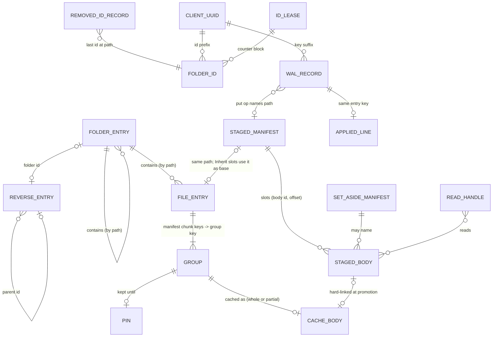

# Data model — local state of one client for one domain

The abstract model of what one machine keeps for one domain: every entity, whether it is
authoritative or rebuildable, the invariants between entities, and **what the domain owner
owns** (P1, with [07](../07-daemon-cli.md), which owns the process model and the ownership
lock). Sections 1–8 name no file or encoding; the byte formats are in
[04](../04-checkout-cache.md) §2, and §9 maps each entity to its format.

An encoding that keeps these entities, identities, invariants and write rules is correct,
whether it stores them in a filesystem tree, an embedded database or a key-value store.

## 1. Purpose and medium

The backend holds content-addressed chunks and manifests filed under folder ids and name
hashes, and may be unreachable. The local state exists to:

1. answer every namespace question (list, stat, lookup) without the network;
2. serve file bytes lazily within a bounded disk budget;
3. hold the user's unpublished edits, the only copy of that data until uploaded;
4. record every unit of owed work before doing it, so no crash leaves a change nothing owes;
5. apply peers' changes, and feed them with this client's own to frontends as an ordered feed.

The medium's required properties (atomic rename, fsync of files and directories, create-if-
absent, advisory locks that die with their holder, sparse files, settable mtimes, optional hard
links) are listed in [durable-queue](../algorithms/durable-queue.md) §2. Every multi-object
change is an ordered sequence of single-object steps; there are no transactions and no
reference counts.

## 2. The owner

On one machine, exactly one process at a time owns a domain's local state: it holds the domain's
ownership lock ([07](../07-daemon-cli.md) §2.3) for as long as it touches that state.

**The owner owns, for its domain**, every entity of §3 except the machine-wide identity (§3.12):
the namespace mirror, the folder-id index, the chunk cache (bodies and pins), the staged tree,
the WAL, the deferred job logs, the applied log, the last-sync mark and resync generation, the
pause flag, the export records, the kept walk and the scratch area, and all the in-memory
state of §3.13.

- Only the owner creates, changes or removes any of it.
- Within the owner, every check-then-act is serialised per domain for metadata and per key for
  content ([04](../04-checkout-cache.md) §3.2).
- The owner runs everything that consumes owned state: reconcile, peer application (on a full
  tree), the queues, the deferred job logs, maintenance and every local recovery step
  ([04](../04-checkout-cache.md) §4.10).

**What other processes may do**:
- read owned objects that the owner replaces atomically (mirror entries, markers, pins), for
  advisory answers only, tolerating any object changing or vanishing between two reads, and
  never writing anything based on what they read;
- submit a new record to one of the domain's logs
  ([durable-queue](../algorithms/durable-queue.md) §4.2);
- as an export command, create and lock its own export records (§3.10);
- nothing else. A process that needs more asks the owner, or takes ownership when there is none.

**Machine-wide identity** (§3.12) is shared by every owner on the machine and arbitrated by
create-if-absent, never by the ownership lock.

**The ownership lock** is a file per domain with an advisory holder record naming the owner, and
the **pause flag** a file per domain whose presence means paused; both are specified by
[07](../07-daemon-cli.md) §2.3, §2.6 and §2.7.

**Host-owned state** lives outside the owner's domain state and outside this model: a host MAY
keep state of its own that feeds the owner through its request interface, and it is responsible
for that state's durability. On Android these are the ingest intents with their staging copies,
and the camera-backup records ([android](../frontends/android.md) §9 and §13). Once the owner has
acknowledged a handover, the content is in the staged tree and the host's copy is disposable.

## 3. Entities

Each entity gives: **Id** (what makes two instances the same), **Attr**, **Mut** (immutable,
replaced whole, appended, or written in place), **Life** and **Class** (§6).

### 3.1 Namespace mirror

This client's projection of the domain's namespace as of the journal entries it has applied.

- **Folder entry.** Id: the logical path. Attr: the real leaf; the folder id (absent only for a
  folder whose marker is unreadable, until a resync). Operations under a folder with no id are
  UNPREPARED.
- **File entry.** Id: the logical path. Attr: the published manifest, byte-identical to the
  store's, with its recorded name set to the entry's leaf; and whether this client stored it
  (*own*). The entry is the path's **view**
  ([conflict-resolution](../algorithms/conflict-resolution.md) §3.3): it becomes a manifest this
  client stored even when that upload's promotion was abandoned, moves with a local rename and
  goes with a local delete. An undecodable entry is CORRUPT for its path and skipped by
  listings.
- **Name record.** Id: the folder entry. Attr: the real leaf of a folder whose local name had to
  be escaped.
- Mut: entries are replaced whole; the tree changes by create, move and remove.
- Life: written by peer application, resync, lazy pulls, local namespace operations, promotion,
  revert and the Put-without-staged-edit recovery; removed by local delete and rmdir, peer
  application, the resync sweep and the lazy prune.
- Class: projection, except that a folder id minted here is final from the mint, and is
  recorded in the WAL until published.

### 3.2 Folder-id index

- **Forward** (path → id): the folder entry's id. It is never minted by a read.
- **Reverse entry.** Id: the folder id. Attr: parent folder id, leaf. A resolution climbs to the
  root, stops on a cycle, and is accepted only if the path it produced maps forward to the same
  id.
- **Removed-id record.** Id: a logical path. Attr: the last folder id at that path. It outlives
  the folder so ops recorded under a removed or moved folder stay nameable; it answers
  *whereabouts*.
- Mut: replaced whole.
- Class: the reverse index is a projection (rebuilt by walking the mirror); removed-id records
  are history, kept for `REMOVED_ID_RETENTION` ([04](../04-checkout-cache.md) §4.9).

### 3.3 Chunk cache

- **Group**: a run of `per` consecutive chunks of one manifest, `per` derived from that
  manifest's chunk size. Id: a digest of the ordered member chunk keys (two files with the same
  run share a body).
- **Whole body.** Id: the group key. Attr: the group's bytes, verified. Its existence means
  whole.
- **Partial body.** Id: the group key. Attr: sparse bytes; which intervals it holds is known
  only to the owner's memory. It does not survive the owner.
- **Residency** (derived): online-only, cached or pinned
  ([04](../04-checkout-cache.md) §3.6).
- Mut: a whole body appears atomically and is replaced only by a forced refetch; a partial body
  is written in place.
- Life: created by reads, prefetch, materialisation and promotion; removed by the cap, evict,
  forget, and (partial bodies) owner start. Removal is reference-blind.
- Class: projection of backend chunks. Any of it may be removed at any time by the owner.

### 3.4 Pins

- Id: the group key: a pin is attached to content, follows it across renames and is shared by
  every file using the body. Attr: a deadline. A pin may exist before its body does.
- Mut: replaced (a re-pin moves the deadline).
- Life: created by pin requests before their fetch; removed by unpin, evict, forget, and by the
  cap once lapsed.
- Class: user intent, acknowledged durably; losing one costs a refetch and a silent loss of the
  offline guarantee, so it is written durably.

### 3.5 Staged edits

Unpublished local writes, in a tree neither the cap nor a resync can address.

- **Staged manifest.** Id: the logical path (same tree shape as the mirror). It wins over the
  published entry of the same path in listings and reads, and is listed even if never published.
  Attr: real name, authoritative size, mtime, chunk size; either a whole-body reference or one
  slot per chunk (Inherit, Zero, Staged(body, offset)); the edit's **base** (the content
  identity of the view it started from, none, or unknown); state **Owed**, or **Committed** with
  the manifest the upload produced. Every local mutation produces Owed.
- **Staged body.** Id: an opaque random id. Attr: bytes in one group's layout (sparse), or a
  whole file. A group body may be written in place only while it is not also a cache body; a
  whole body is never written in place.
- **Set-aside manifest.** A staged manifest that could not be decoded. Kept under a name no
  reader lists, never decoded, never deleted automatically, reported; it keeps every body it
  may name alive.
- Mut: manifests replaced whole; group bodies written in place, grown and resized.
- Life: a manifest is created by the first write, truncate, create or handover; moved by
  renames and asides; removed by promotion, delete, create, revert, a replacing rename, or a
  recursive rmdir. A body is released when no manifest, set-aside manifest or open read handle
  names it, after the switch away from it is durable.
- Class: **authoritative, the sole copy of user data.**

### 3.6 Write-ahead log

One record per unit of work this client owes the store.

- Id: an **entry key** (start time, client uuid), totally ordered. The same key names the work
  for its whole life: WAL record, journal entry, cursor value, applied-log line, change-feed
  anchor ([wal-and-journal](../algorithms/wal-and-journal.md) §3.1).
- Attr: ops (journal vocabulary), state (Intent, Prepared, Executed:
  [wal-and-journal](../algorithms/wal-and-journal.md) §4.1), attempt count, last failure; for
  each delete and file rename, the expected prior record; while a retargeted record is in
  Intent, the file's current local location. A record submitted by a non-owner carries a
  submission id until the owner re-keys it.
- **Set-aside record**: an undecodable record, kept and reported like a set-aside manifest.
- Mut: replaced whole on every change.
- Life: metadata records are created before their local half; put records at close, at a
  handover, by a bulk publisher (possibly as a submission), by revert, and by the adoption of an
  unrecorded staged edit; records are removed by discharge, or when nothing is owed.
- Class: **authoritative, the sole record of owed work.** A staged edit with no record is legal
  between a write and its close; owner start adopts it.

### 3.7 Deferred job logs

- Id: one log per (domain, replica or backfill target); one record per job.
- Attr: a bodyless job (put, copy, delete of backend keys) that brings the target's key to the
  source's current state ([replication](../algorithms/replication.md)).
- Life: created by the owner or submitted by a non-owner writer before the main write is
  acknowledged; run and removed by the owner; parked on a non-retryable failure and retried.
- Class: **authoritative, the sole record of owed replication.**

### 3.8 Applied log

The journal entries this client has published or applied, in the order handled; the change
feed. Format: [03](../03-journal-sync.md). Retention: by age only, never by size
([wal-and-journal](../algorithms/wal-and-journal.md) §4.8).

- Id of a line: its entry key; position, not key order, is the feed order.
- Mut: append-only.
- Class: authoritative history for dedupe and the feed; not rebuildable from the store once the
  journal is pruned.

### 3.9 Last-sync mark, resync generation, pause flag

- **Last-sync mark**: one entry key, forward-only, meaning "every due entry older than this has
  been seen and handled"; it also drives the bridging test
  ([wal-and-journal](../algorithms/wal-and-journal.md) §4.8).
- **Resync generation**: an opaque token carried by change-feed anchors; an anchor of another
  generation reads as stale ([07](../07-daemon-cli.md)).
- **Pause flag** ([07](../07-daemon-cli.md) §2.6).
- Mut: replaced whole, durably. Class: authoritative bookkeeping; loss costs a rebuild, a
  re-list or a lost pause, never data.

### 3.10 Export records

Resume records of in-progress exports ([05](../05-ops-config.md) §4.4). Authoritative only about
the destination's progress; loss costs a re-export. The export command, which need not be the
owner, holds an exclusive lock on each record it uses for its whole run; the owner's sweep removes
only unlocked records older than its grace. This is the one domain-local object a non-owner
writes besides submissions.

### 3.10a Pending folder-claim confirmations

- Id: a record per folder claim not yet confirmed
  ([data-model/backend](backend.md) §6.2).
- Attr: tentative folder id, parent id, name, the time the claim landed
  ([04](../04-checkout-cache.md) §2.9); the protocol is [data-model/backend](backend.md) §6.2.
- Life: recorded durably by the owner when it claims a folder name on the store; run after the
  settle delay; removed once confirmed; resumed by every owner start.
- Class: **authoritative**: a lost confirmation could leave a lost claim undetected.

### 3.11 Kept walk, scratch, temporaries

- **Kept walk**: the paging snapshot of a whole-domain listing ([07](../07-daemon-cli.md)).
- **Frontend scratch**: files a frontend holds beside the namespace and never publishes.
- **Temporary objects**: the write-aside half of every replacement ([01](../01-core.md) §2.9).
- All disposable; scratch and the kept walk are wiped by resync.

### 3.12 Machine-wide identity

- **Client uuid**: one per data directory, shared by all domains; created once by durable
  create-if-absent (the loser adopts the winner's); immutable. Losing it would make this machine
  a new client whose own WAL records are foreign.
- **Folder-id lease**: a block of counter values one process may mint folder ids from; created
  by durable create-if-absent before its first id is used ([03](../03-journal-sync.md) §2.1).
  Leases MUST never let a block be leased twice.
- Class: authoritative.

### 3.13 In the owner's memory

One instance per domain per owner, shared by every consumer in the owner: the metadata and key
locks and edit generations ([04](../04-checkout-cache.md) §3.2); read handles
([04](../04-checkout-cache.md) §3.3); the cache's body locks,
generations, held intervals, in-flight table and counts
([read-path-and-cache](../algorithms/read-path-and-cache.md) §3.2); the queues' loaded records
and slots ([durable-queue](../algorithms/durable-queue.md) §3.1); the dedupe set and the cursor
debouncer ([wal-and-journal](../algorithms/wal-and-journal.md) §3.3). All are rebuilt from
durable state at owner start. Retentions of open-and-unlinked content
([04](../04-checkout-cache.md) §3.3) are among the read handles.

## 4. Relations

| Reference | By | A dangling reference means |
|---|---|---|
| file entry → group | content | not cached: fetch on demand |
| pin → body | content | a pin placed before its fetch, or whose body was evicted after it lapsed; inert |
| staged slot → staged body | body id | cannot happen by §5.2; if found, CORRUPT: the edit is kept, reported, and its record parked, never abandoned |
| staged Inherit slot → base entry | path | CORRUPT; zeros are never served as content |
| staged manifest → WAL record | path via a put op | the file is open, or a crash fell before close: owner start adopts it |
| WAL put record → staged manifest | path | nothing staged: the record publishes only if the store holds a manifest at the path ([durable-queue](../algorithms/durable-queue.md) §7.3) |
| WAL rename → path | path | retargeted when a conflict aside moves the destination |
| folder id → path | reverse chain | unresolvable until rebuild; operations refuse rather than guess |
| removed-id record → folder id | path | expected: the id lives on after the folder |
| change-feed anchor → applied line | generation and entry key | pruned or another generation: the reader re-lists |
| deferred job → backend key | key | the job re-derives from the source's current state |

## 5. Invariants

### 5.1 At rest

1. **A whole-body name means whole and verified.** Partial bodies never survive their owner.
2. **Held intervals never exceed the disk**
   ([read-path-and-cache](../algorithms/read-path-and-cache.md) I1).
3. **Staged is unreachable by projection maintenance**: the cap, evict, resync and the lazy
   prune never address the staged tree, by separation of stores.
4. **Every body a staged manifest names exists**, up to the bytes it holds.
5. **Committed means published**: a Committed manifest's commit record names a manifest the
   store holds.
6. **Nothing owed is unrecorded**: every change owed to the store is covered by a WAL record or
   by an unrecorded Owed staged edit that owner start adopts. A metadata change's record
   precedes its local effect.
7. **One unit of work, one key** across WAL record, entry, applied line and anchor.
8. **Folder ids are final and unique**: a folder holds at most one id, a browse never replaces
   it, ids are unique across clients (uuid prefix) and processes (leases).
9. **The reverse index is verified before use.**
10. **Mirror completeness** (full tree): absence in the mirror is absence in the domain, as of
    the entries applied.
11. **The last-sync mark is monotone.**
12. **An applied line means done**: a peer entry's line exists only after its effects are
    durable; an own entry's line only for a record that still exists or whose entry is on the
    store.
13. **Nothing authoritative is ever discarded because it could not be decoded**: it is set
    aside, with everything it may reference.

### 5.2 Durability order

Every authoritative write obeys [durable-queue](../algorithms/durable-queue.md) §3 (R1–R6). The
local referent → referrer pairs it governs:

| Referent (durable first) | Referrer |
|---|---|
| staged bodies | the staged manifest naming them |
| the staged manifest (at sync and close) | the WAL put record |
| the manifest on the store | the Committed staged manifest |
| the WAL record's `Executed` state | the promotion's removal of the staged manifest |
| cache groups and the mirror entry of a promotion | the release of the staged manifest, then of its bodies |
| a metadata op's local effects | its WAL record's `Prepared` state |
| a peer entry's local effects | its applied line |
| a lease | the first folder id minted from it |

Releases go the other way: the staged bodies an edit replaced are released after the new
manifest is durable, and after every read handle on them has closed.

### 5.3 Temporarily violated

| Invariant or state | During | Repaired by |
|---|---|---|
| mirror completeness | a resync walk (stale entries until the sweep); always on a lazy tree | the sweep, after a complete walk only; the next pull of that folder |
| folder-index consistency | a reparent; a crash in one | verification on read; rebuild; the resync sweep |
| unrecorded staged edit | first write → close; a crash before close | owner start adoption |
| WAL state behind reality | any crash | reconcile ([wal-and-journal](../algorithms/wal-and-journal.md) §4.7) and the upload job's state check ([04](../04-checkout-cache.md) §4.6) |
| unnamed staged body | a crash between a body's creation and the manifest naming it; a deferred release | the owner-start sweep ([04](../04-checkout-cache.md) §4.10) |
| Committed staged edit not promoted | a crash during an upload's tail | owner start promotes it |
| temporary object | a crash mid-replace | the temporary sweep |
| partial body | always, while its owner runs | removed at owner start |

## 6. Authoritative or derived

| Entity | Class | Rebuilt from |
|---|---|---|
| staged manifests, staged bodies, set-aside manifests | **authoritative: sole copy of user data** | never |
| WAL records, set-aside records | **authoritative: sole record of owed work** | never; only an unrecorded staged edit is re-derived (adoption) |
| deferred job logs | **authoritative: sole record of owed replication** | never |
| client uuid, leases | **authoritative identity** | never |
| pins | authoritative user intent | re-pin |
| applied log | authoritative history | not rebuildable; loss causes re-application (idempotent) and a stale feed |
| last-sync mark, resync generation, pause flag | authoritative bookkeeping | loss causes a rebuild, a re-list, a lost pause |
| export records | authoritative about the destination only | re-export |
| folder ids in the mirror | authoritative once minted here, until published; otherwise projection of store markers | resync (the store's id wins) |
| removed-id records | history | not rebuildable; loss makes some old ops unnameable |
| namespace mirror | projection of the store and the applied journal | resync (full); pulls (lazy) |
| reverse folder index | projection of the mirror | rebuild |
| chunk cache | projection of backend chunks | any read |
| kept walk, scratch, temporaries, spools | disposable | nothing |

## 7. Full and lazy trees

The two trees differ in what the mirror promises, not in their entities.

- **Full** (desktop hosts): the mirror is complete; the owner's journal poller keeps it current;
  a resync rebuilds it; the applied log carries own and peer entries; the last-sync mark is
  maintained.
- **Lazy** (Android): the mirror caches the folders the user has opened; absence means "not
  fetched"; it is refreshed by pulls ([android](../frontends/android.md) §3.2), each overlaid
  with the owed work touching the folder and never skipped because of it, and a pull that cannot
  read every child changes nothing ([04](../04-checkout-cache.md) §3.5); there is no poller, no peer application
  and no resync; the applied log holds own entries only and the last-sync mark is never
  written. Staged edits, the WAL, identity and deferred logs are exactly as on the full tree,
  and the app is their owner, resuming them at every start. Hard links may be unsupported, so
  promotion may copy.

## 8. Growth and reclamation

| Grows with | Bound, reclaimer |
|---|---|
| chunk cache: reads, prefetch, promotion | the cap by coldest mtime, excluding pinned bytes; after uploads and periodically. No cap configured: unbounded by the user's choice |
| partial bodies | removed at owner start; counted by the cap meanwhile |
| pins | lapsed pins removed by the cap walk |
| staged edits | upload and promotion; unnamed bodies by the owner-start sweep |
| set-aside manifests and records | reported; removed only by an explicit user request |
| WAL, deferred logs | discharge; they grow with owed work while offline, by design |
| parked records | retried; reported until they succeed |
| applied log | age only ([wal-and-journal](../algorithms/wal-and-journal.md) §4.8) |
| removed-id records | retention of [04](../04-checkout-cache.md) §4.9 |
| id leases | [03](../03-journal-sync.md) §2.1 (never reusing a block) |
| export records | deleted on completion; age sweep ([05](../05-ops-config.md)) |
| temporaries | the temporary sweep |
| scratch, kept walk | wiped by resync; one walk per domain |
| conflicted copies | user-visible files; never reclaimed automatically |
| pending claim confirmations | removed once confirmed |
| in-memory state | rebuilt at owner start; handles and retentions bounded by the frontends' open files |

## 9. Encoding

Every optional field and optional file has a stated meaning when absent
([04](../04-checkout-cache.md) §2); no operation requires rewriting a valid existing file.

| Entity | Specified in |
|---|---|
| mirror entries, folder, name and own markers | [04](../04-checkout-cache.md) §2.3 |
| reverse entries, removed-id records | [04](../04-checkout-cache.md) §2.4 |
| staged manifests, set-aside names | [04](../04-checkout-cache.md) §2.5 |
| staged bodies | [04](../04-checkout-cache.md) §2.6 |
| cache bodies, partial bodies, pins | [04](../04-checkout-cache.md) §2.7 |
| WAL records, set-aside records | [04](../04-checkout-cache.md) §2.8 |
| queue log layout, record names, submissions, re-keying | [durable-queue](../algorithms/durable-queue.md) §4.1–§4.2, [04](../04-checkout-cache.md) §2.8 |
| pending claim confirmations | [04](../04-checkout-cache.md) §2.9 |
| applied log, last-sync mark, entry keys, client uuid, leases | [03](../03-journal-sync.md) |
| deferred job bodies | [06](../06-backends.md) |
| export records, spools | [05](../05-ops-config.md) |
| ownership lock, pause flag, resync generation, kept walk | [07](../07-daemon-cli.md) |
| temporary names, leaf escaping | [01](../01-core.md) |

## 10. Conformance

An implementation MUST exhibit the following model-level properties; the operation-level ones
are in [04](../04-checkout-cache.md) §6 and
[read-path-and-cache](../algorithms/read-path-and-cache.md) §8.

- Removing the whole chunk cache, running the cap at 0, a resync and a lazy prune leave every
  staged edit and set-aside manifest, with its bodies, intact.
- A second process never writes the domain's local state while an owner holds the lock, other
  than submissions and export records; its reads never observe a torn object.
- After any crash, owner start leaves no partial body, no unnamed staged body, no Committed staged
  edit and no staged edit without a WAL record.
- The last-sync mark never moves backwards, and an applied line exists only for work whose
  effects are durable.
